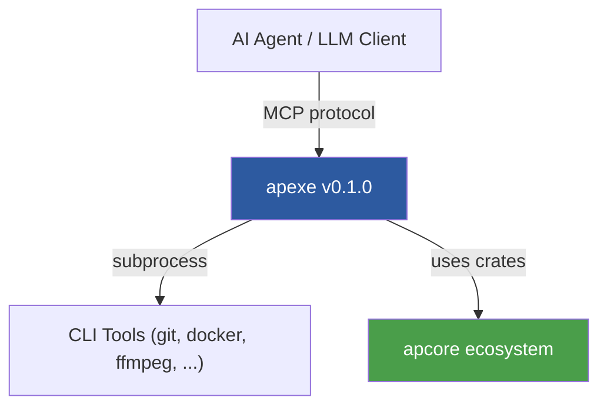
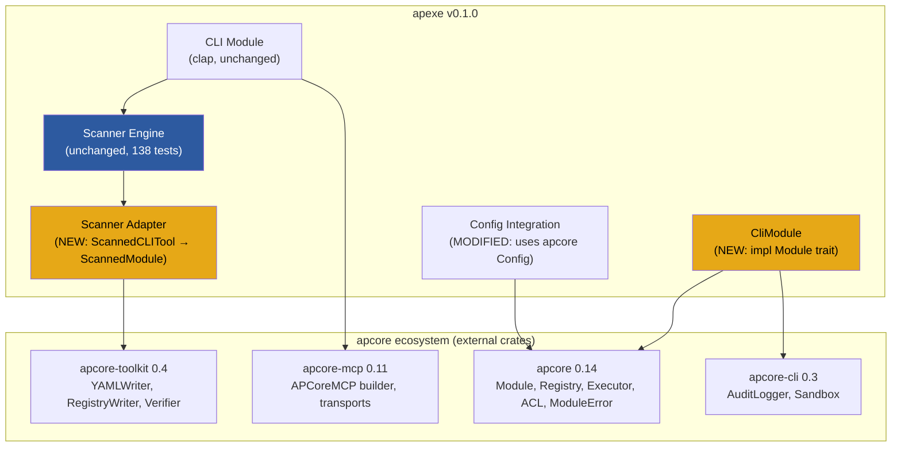
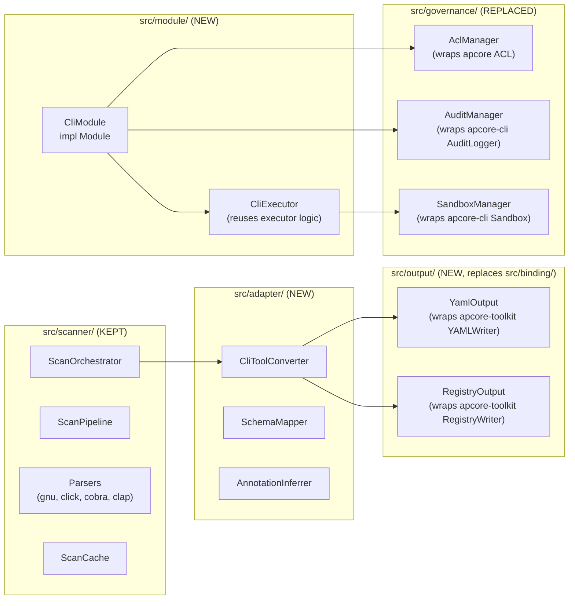
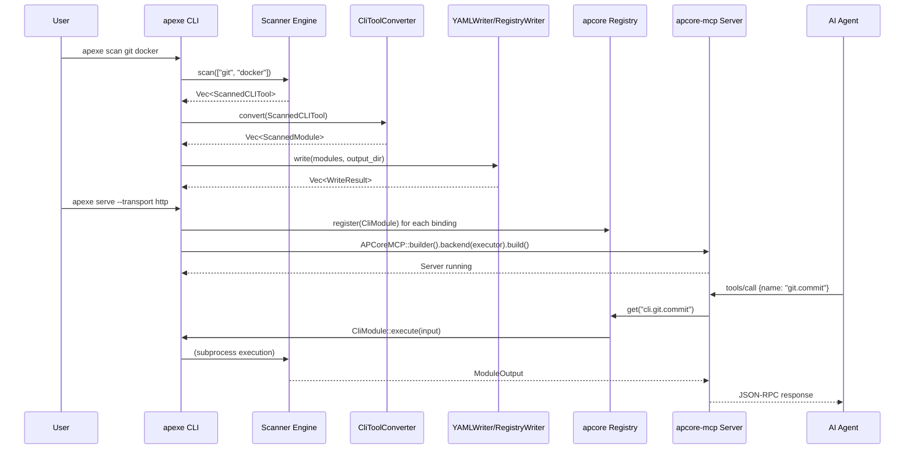
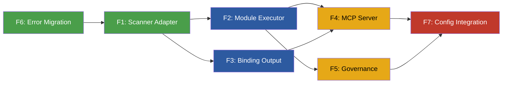

# Technical Design Document: apexe v0.1.0 -- Full apcore Ecosystem Integration

| Field | Value |
|---|---|
| **Authors** | apexe team |
| **Status** | Draft |
| **Created** | 2026-03-27 |
| **Target Version** | 0.1.0 |
| **Last Updated** | 2026-03-27 |

---

## 1. Executive Summary

apexe v0.1.0 replaces all custom infrastructure (MCP server, binding generator, governance, error types) with battle-tested apcore ecosystem crates while preserving the unique 3-tier deterministic scanner engine. The result is a thinner, more maintainable codebase that inherits protocol compliance, authentication, middleware, and output tooling from the ecosystem rather than reimplementing them.

**What changes**: The binding generator, MCP server, governance layer, error types, and configuration system are replaced by apcore-toolkit, apcore-mcp, apcore core types, and apcore-cli library utilities.

**What stays**: The scanner engine (`src/scanner/`), CLI interface (`src/cli/`), and domain models (`src/models/`) remain. A new conversion layer bridges `ScannedCLITool` to `ScannedModule`.

**Why now**: The apcore ecosystem has matured to the point where apexe's custom implementations duplicate functionality that the ecosystem provides with better protocol compliance, authentication support, and community maintenance. Continuing to maintain custom implementations creates drift risk and slows feature delivery.

---

## 2. Background and Motivation

### 2.1 Current State (v0.1.x)

apexe v0.1.1 is approximately 9,500 lines of Rust across 393 tests. It successfully wraps arbitrary CLI tools into MCP-compatible modules through a 3-tier scanning pipeline (--help parsing, man page enrichment, shell completion enrichment). However, six of its eight modules are custom implementations of functionality that the apcore ecosystem now provides:

| apexe v0.1.x Module | Lines (approx) | Ecosystem Equivalent |
|---|---|---|
| `src/serve/` (MCP server) | ~1,200 | apcore-mcp 0.11 |
| `src/binding/` (YAML writer) | ~800 | apcore-toolkit 0.4 |
| `src/governance/` (ACL, audit) | ~600 | apcore 0.14 ACL + apcore-cli 0.3 AuditLogger |
| `src/errors.rs` (error types) | ~120 | apcore 0.14 ModuleError + ErrorCode |
| `src/executor/` (subprocess) | ~400 | Needs Module trait wrapper |
| `src/config.rs` (config loader) | ~110 | apcore 0.14 Config (partial) |

### 2.2 Problems with Custom Implementations

1. **Protocol drift**: The custom MCP server implements a subset of the MCP specification. As the spec evolves, apexe must track changes independently.
2. **Missing features**: No JWT authentication, no middleware pipeline, no streamable-http transport, no verification tooling.
3. **Maintenance burden**: Every bug fix or protocol update in the ecosystem must be manually replicated.
4. **Integration gap**: apexe modules cannot participate in apcore middleware chains, registry discovery, or cross-module orchestration.

### 2.3 Why Integrate Now

- apcore-mcp 0.11 provides stable Rust bindings with stdio, streamable-http, and SSE transports plus JWT authentication.
- apcore-toolkit 0.4 provides `ScannedModule`, `YAMLWriter`, `RegistryWriter`, and `Verifier` -- exactly the output pipeline apexe needs.
- apcore 0.14 provides `Module` trait, `Registry`, `Executor`, `ACL`, and `ModuleError` -- the governance and execution primitives.
- apcore-cli 0.3 provides `AuditLogger` and `Sandbox` -- audit and isolation without pulling in the CLI framework.

---

## 3. Design Goals and Non-Goals

### 3.1 Goals

| ID | Goal | Rationale |
|---|---|---|
| G1 | Replace custom MCP server with apcore-mcp | Gain protocol compliance, auth, transports |
| G2 | Replace custom binding output with apcore-toolkit writers | Gain verification, display resolution, deduplication |
| G3 | Replace custom governance with apcore ACL + apcore-cli audit | Gain rule conditions, JSONL audit, sandbox |
| G4 | Implement apcore Module trait for CLI subprocess execution | Enable middleware, registry, executor integration |
| G5 | Migrate errors to apcore ModuleError + ErrorCode | Unified error model across ecosystem |
| G6 | Preserve scanner engine unchanged | Scanner is the unique value; no regressions |
| G7 | Maintain CLI interface compatibility | `apexe scan/serve/list/config` commands unchanged |
| G8 | Delete replaced code, reduce total LOC | Less code to maintain |

### 3.2 Non-Goals

| ID | Non-Goal | Rationale |
|---|---|---|
| NG1 | Make apexe a plugin of apcore-cli | apexe and apcore-cli are inverse directions |
| NG2 | Rewrite the scanner engine | Working correctly with 138 tests |
| NG3 | Add new scanning capabilities in this version | Scope control; scanner improvements are v0.3.0 |
| NG4 | Support A2A protocol in v0.1.0 | MCP is the priority; A2A can layer on later |
| NG5 | Implement custom middleware | Use built-in apcore middleware (logging, retry, tracing) |

---

## 4. Architecture Overview

### 4.1 System Context (C4 Level 1)



### 4.2 Container Diagram (C4 Level 2)



### 4.3 Component Diagram (C4 Level 3)



### 4.4 Data Flow: Scan to Serve



---

## 5. Detailed Design

### 5.1 Dependency Integration Map

| apexe v0.1.x Module | Replaced By | Crate | Key Types Used |
|---|---|---|---|
| `src/binding/binding_gen.rs` | `src/output/yaml.rs` | apcore-toolkit 0.4 | `ScannedModule`, `YAMLWriter`, `WriteResult` |
| `src/binding/schema_gen.rs` | `src/adapter/schema.rs` | apcore-toolkit 0.4 | Input/output schema via `ScannedModule` fields |
| `src/binding/module_id.rs` | `src/adapter/converter.rs` | apcore-toolkit 0.4 | `deduplicate_ids()` |
| `src/binding/writer.rs` | `src/output/yaml.rs` | apcore-toolkit 0.4 | `YAMLWriter`, `YAMLVerifier` |
| `src/serve/handler.rs` | Removed | apcore-mcp 0.11 | `APCoreMCP` builder |
| `src/serve/mcp_types.rs` | Removed | apcore-mcp 0.11 | Internal MCP types |
| `src/serve/registry.rs` | `src/module/` | apcore 0.14 | `Registry`, `Module` trait |
| `src/serve/loader.rs` | `src/output/loader.rs` | apcore-toolkit 0.4 | `DisplayResolver` |
| `src/serve/stdio.rs` | Removed | apcore-mcp 0.11 | Transport: "stdio" |
| `src/serve/http.rs` | Removed | apcore-mcp 0.11 | Transport: "streamable-http" |
| `src/serve/config_gen.rs` | Kept (apexe-specific) | -- | Config snippet generation |
| `src/governance/acl.rs` | `src/governance/acl.rs` | apcore 0.14 | `ACL`, `ACLRule` |
| `src/governance/annotations.rs` | `src/adapter/annotations.rs` | apcore 0.14 | `ModuleAnnotations` |
| `src/governance/audit.rs` | `src/governance/audit.rs` | apcore-cli 0.3 | `AuditLogger` |
| `src/executor/mod.rs` | `src/module/executor.rs` | apcore 0.14 | `Module` trait + existing logic |
| `src/errors.rs` | `src/errors.rs` | apcore 0.14 | `ModuleError`, `ErrorCode` |
| `src/config.rs` | `src/config.rs` | apcore 0.14 | `Config` (partial) |

#### New Cargo.toml Dependencies

```toml
[dependencies]
# Existing (kept)
clap = { version = "4", features = ["derive"] }
tokio = { version = "1", features = ["full"] }
serde = { version = "1", features = ["derive"] }
serde_json = "1"
serde_yaml = "0.9"
nom = "7"
regex = "1"
tracing = "0.1"
tracing-subscriber = { version = "0.3", features = ["env-filter"] }
thiserror = "2"
sha2 = "0.10"
shell-words = "1"
uuid = { version = "1", features = ["v4", "serde"] }
which = "7"
dirs = "5"
chrono = { version = "0.4", features = ["serde"] }

# NEW: apcore ecosystem
apcore = { version = "0.14", features = ["full"] }
apcore-toolkit = "0.4"
apcore-mcp = "0.11"
apcore-cli = { version = "0.3", default-features = false, features = ["audit", "sandbox", "output"] }

# Removed: axum (provided by apcore-mcp), anyhow (replaced by ModuleError)
```

### 5.2 Scanner Engine (Kept As-Is)

The scanner engine in `src/scanner/` is preserved without modification. It contains 138 tests covering the 3-tier pipeline (help parsing, man page enrichment, shell completion enrichment) and the four format-specific parsers (GNU, Click, Cobra, Clap).

**Files unchanged**:
- `src/scanner/mod.rs`
- `src/scanner/orchestrator.rs`
- `src/scanner/resolver.rs`
- `src/scanner/pipeline.rs`
- `src/scanner/protocol.rs`
- `src/scanner/discovery.rs`
- `src/scanner/cache.rs`
- `src/scanner/completion.rs`
- `src/scanner/man_page.rs`
- `src/scanner/plugins.rs`
- `src/scanner/parsers/*.rs`

**Output type unchanged**: `ScannedCLITool` remains in `src/models/mod.rs`.

**Interface contract**: The scanner continues to produce `Vec<ScannedCLITool>`. A new adapter layer (Section 5.2.1) converts this output to `Vec<ScannedModule>` for downstream consumption.

#### 5.2.1 Scanner Adapter: ScannedCLITool to ScannedModule

A new module `src/adapter/` provides the conversion layer. See Feature Spec F1 for full details.

**Key type mapping**:

| ScannedCLITool field | ScannedModule field | Transformation |
|---|---|---|
| `name` + command path | `module_id` | `cli.{tool}.{subcommand}` namespaced ID |
| `ScannedCommand.description` | `description` | Direct copy |
| `ScannedCommand.flags` + `positional_args` | `input_schema` | JSON Schema generation (reuses existing `SchemaGenerator` logic) |
| `structured_output` | `output_schema` | JSON or raw text schema |
| `name` | `tags` | `["cli", tool_name, help_format]` |
| binary_path + command | `target` | `exec://{binary_path} {command}` |
| `version` | `version` | Direct copy or "unknown" |
| Inferred from command name | `annotations` | `ModuleAnnotations` (readonly, destructive, idempotent) |
| `warnings` | `warnings` | Direct copy |
| `raw_help` + `examples` | `documentation`, `examples` | Structured documentation |

**Conversion signature**:

```rust
impl From<&ScannedCLITool> for Vec<ScannedModule> {
    fn from(tool: &ScannedCLITool) -> Vec<ScannedModule> { ... }
}
```

This produces one `ScannedModule` per leaf command (commands with no subcommands), flattening the tree. The `CliToolConverter` struct provides additional configuration (namespace prefix, annotation inference rules).

### 5.3 Binding Generator Replacement

**Deleted**: `src/binding/binding_gen.rs`, `src/binding/schema_gen.rs`, `src/binding/module_id.rs`, `src/binding/writer.rs`

**New**: `src/output/yaml.rs`, `src/output/registry.rs`, `src/output/mod.rs`

The new output layer wraps apcore-toolkit's `YAMLWriter` and `RegistryWriter`:

```rust
// src/output/yaml.rs
pub struct YamlOutput {
    writer: YAMLWriter,
    verifiers: Vec<Box<dyn Verifier>>,
}

impl YamlOutput {
    pub fn new() -> Self { ... }
    pub fn write(
        &self,
        modules: &[ScannedModule],
        output_dir: &Path,
        dry_run: bool,
    ) -> Result<Vec<WriteResult>, ModuleError> { ... }
}
```

**Verification**: Uses `YAMLVerifier` and `SyntaxVerifier` from apcore-toolkit to validate output before writing.

**Display resolution**: Uses `DisplayResolver` to merge display metadata from existing binding files when re-scanning.

See Feature Spec F3 for full details.

### 5.4 MCP Server Replacement

**Deleted**: `src/serve/handler.rs`, `src/serve/mcp_types.rs`, `src/serve/registry.rs`, `src/serve/loader.rs`, `src/serve/stdio.rs`, `src/serve/http.rs`

**Kept**: `src/serve/config_gen.rs` (apexe-specific integration config snippets)

**New**: Server construction moves to `src/cli/mod.rs` `ServeArgs::execute()`, using `APCoreMCP::builder()`:

```rust
// In ServeArgs::execute()
let registry = Registry::new();
for module in modules {
    let cli_module = CliModule::from_scanned(module, sandbox.clone(), audit.clone());
    registry.register(cli_module)?;
}

let executor = Executor::new(registry.clone(), executor_config);
executor.set_acl(acl)?;
executor.use_middleware(LoggingMiddleware::new())?;
executor.use_middleware(TracingMiddleware::new())?;

let server = APCoreMCP::builder()
    .backend(BackendSource::Executor(Arc::new(executor)))
    .name(&self.name)
    .transport(&self.transport)
    .host(&self.host)
    .port(self.port)
    .validate_inputs(true)
    .include_explorer(self.explorer)
    .build()?;

server.serve();
```

**Transport mapping**:
- `"stdio"` maps to apcore-mcp `"stdio"` transport
- `"http"` maps to apcore-mcp `"streamable-http"` transport
- `"sse"` maps to apcore-mcp `"sse"` transport

**Authentication**: Optional JWT auth via `--require-auth` flag (new CLI argument).

See Feature Spec F4 for full details.

### 5.5 Governance Replacement

**Deleted**: `src/governance/acl.rs` (custom ACL generator), `src/governance/annotations.rs` (custom annotation logic), `src/governance/audit.rs` (custom audit logger)

**New**:

#### 5.5.1 ACL Manager

```rust
// src/governance/acl.rs
pub struct AclManager {
    acl: ACL,
}

impl AclManager {
    pub fn from_config(config_path: &Path) -> Result<Self, ModuleError> { ... }

    pub fn generate_default(modules: &[ScannedModule]) -> ACL {
        let mut rules = Vec::new();
        // Auto-allow readonly modules
        // Require approval for destructive modules
        // Deny-by-default for everything else
        ACL::new(rules, Effect::Deny)
    }
}
```

Uses apcore `ACL`, `ACLRule`, and `Effect` types directly. Rule generation logic is preserved but expressed through apcore types.

#### 5.5.2 Audit Manager

```rust
// src/governance/audit.rs
pub struct AuditManager {
    logger: AuditLogger,
}

impl AuditManager {
    pub fn new(audit_path: &Path) -> Self {
        Self { logger: AuditLogger::new(audit_path) }
    }

    pub fn log_execution(&self, module_id: &str, input: &Value, output: &Value, duration_ms: u64) {
        self.logger.log_execution(module_id, input, output, duration_ms);
    }
}
```

Uses apcore-cli `AuditLogger` for append-only JSONL audit logging.

#### 5.5.3 Sandbox Manager

```rust
// src/governance/sandbox.rs
pub struct SandboxManager {
    sandbox: Sandbox,
}

impl SandboxManager {
    pub fn new(enabled: bool, timeout_ms: u64) -> Self {
        Self { sandbox: Sandbox::new(enabled, timeout_ms) }
    }

    pub fn execute(&self, module_id: &str, input: &Value) -> Result<Value, ModuleError> {
        self.sandbox.execute(module_id, input)
    }
}
```

Uses apcore-cli `Sandbox` for subprocess isolation with configurable timeouts.

See Feature Spec F5 for full details.

### 5.6 CLI Module Execution (New: Module Trait Implementation)

This is the central new component. Each CLI command becomes an apcore `Module`:

```rust
// src/module/cli_module.rs
pub struct CliModule {
    module_id: String,
    description: String,
    input_schema: Value,
    output_schema: Value,
    annotations: ModuleAnnotations,
    binary_path: String,
    command_parts: Vec<String>,
    json_flag: Option<String>,
    timeout_ms: u64,
    sandbox: Option<Arc<SandboxManager>>,
    audit: Option<Arc<AuditManager>>,
}

#[async_trait]
impl Module for CliModule {
    async fn execute(&self, ctx: &Context<SharedData>, input: Value) -> Result<Value, ModuleError> {
        // 1. Validate input against input_schema
        // 2. Check ACL via ctx
        // 3. Build command arguments from input (reuses executor logic)
        // 4. Validate no injection
        // 5. Execute subprocess (via sandbox if enabled)
        // 6. Log audit entry
        // 7. Parse and return output
    }

    fn input_schema(&self) -> Option<Value> { Some(self.input_schema.clone()) }
    fn output_schema(&self) -> Option<Value> { Some(self.output_schema.clone()) }
    fn description(&self) -> &str { &self.description }

    fn preflight(&self, input: &Value) -> Result<(), ModuleError> {
        // Validate injection prevention before execution
    }
}
```

**Key design decisions**:
- Each `CliModule` encapsulates one CLI command (leaf-level, no subcommand nesting).
- The `execute()` method is async but delegates subprocess work to `tokio::task::spawn_blocking`.
- Injection validation happens in `preflight()` so middleware can intercept before execution.
- The existing `execute_cli()` function is refactored into internal helpers within `CliModule`, not exposed publicly.

See Feature Spec F2 for full details.

### 5.7 Error Handling Migration

**Current**: `ApexeError` enum with 7 variants (thiserror).

**New**: `ApexeError` remains for scanner-internal errors. A new conversion layer maps to `ModuleError` at the boundary:

```rust
// src/errors.rs (modified)
impl From<ApexeError> for ModuleError {
    fn from(err: ApexeError) -> ModuleError {
        match err {
            ApexeError::ToolNotFound { tool_name } => ModuleError {
                code: ErrorCode::ModuleNotFound,
                message: format!("CLI tool '{}' not found on PATH", tool_name),
                details: None,
                trace_id: None,
                retryable: false,
                ai_guidance: Some(format!("The tool '{}' is not installed. Install it and try again.", tool_name)),
            },
            ApexeError::ScanTimeout { command, timeout } => ModuleError {
                code: ErrorCode::Timeout,
                message: format!("Command '{}' timed out after {}s", command, timeout),
                details: None,
                trace_id: None,
                retryable: true,
                ai_guidance: Some("The command took too long. Try with simpler arguments or increase timeout.".into()),
            },
            ApexeError::CommandInjection { param_name, chars } => ModuleError {
                code: ErrorCode::ValidationFailed,
                message: format!("Parameter '{}' contains prohibited characters: {:?}", param_name, chars),
                details: None,
                trace_id: None,
                retryable: false,
                ai_guidance: Some("Remove shell metacharacters from the input.".into()),
            },
            // ... remaining mappings
        }
    }
}
```

**ErrorCode mapping**:

| ApexeError variant | ErrorCode |
|---|---|
| `ToolNotFound` | `ModuleNotFound` |
| `ScanError` | `InternalError` |
| `ScanTimeout` | `Timeout` |
| `ScanPermission` | `Unauthorized` |
| `CommandInjection` | `ValidationFailed` |
| `ParseError` | `InternalError` |
| `Io` | `InternalError` |
| `Yaml` / `Json` | `SerializationError` |

See Feature Spec F6 for full details.

### 5.8 Configuration Integration

**Current**: `ApexeConfig` with 3-tier resolution (defaults, YAML file, env vars, CLI overrides).

**New**: `ApexeConfig` remains but delegates to apcore `Config` for ecosystem-shared settings:

```rust
// src/config.rs (modified)
pub struct ApexeConfig {
    // apexe-specific settings (kept)
    pub scan_depth: u32,
    pub json_output_preference: bool,

    // Delegated to apcore Config
    pub core_config: apcore::Config,

    // Paths (kept, apexe-specific directory layout)
    pub modules_dir: PathBuf,
    pub cache_dir: PathBuf,
    pub config_dir: PathBuf,
    pub audit_log: PathBuf,
}
```

The `core_config` field provides access to apcore's standard settings (log level, timeout, registry configuration) while apexe-specific settings (scan depth, cache directory, modules directory) remain on `ApexeConfig`.

The 4-tier precedence from apcore-cli `ConfigResolver` is adopted: CLI flags > env vars > config file > defaults.

See Feature Spec F7 for full details.

---

## 6. Alternative Solutions

### 6.1 Alternative A: Thin Wrapper (Selected)

Replace custom infrastructure with apcore ecosystem crates, keeping apexe as an independent binary. The scanner engine stays unchanged. A conversion layer bridges scanner output to ecosystem types.

### 6.2 Alternative B: apcore-cli Plugin

Make apexe a plugin of apcore-cli rather than an independent binary. The scanner would register commands into apcore-cli's command tree.

**Rejected because**:
- apexe and apcore-cli are inverse directions (CLI-to-apcore vs apcore-to-CLI)
- Plugin architecture would couple apexe's release cycle to apcore-cli
- Users who only need apexe would be forced to install apcore-cli

### 6.3 Alternative C: Fork and Vendor

Copy relevant apcore ecosystem code directly into apexe rather than depending on crates.

**Rejected because**:
- Defeats the purpose of ecosystem integration
- Creates maintenance burden tracking upstream changes
- Loses automatic updates from ecosystem improvements

### 6.4 Comparison Matrix

| Criterion | A: Thin Wrapper | B: Plugin | C: Fork |
|---|---|---|---|
| Independence | High | Low | High |
| Maintenance | Low | Low | High |
| Feature access | Full | Full | Snapshot |
| Release coupling | Loose | Tight | None |
| Code duplication | None | None | High |
| User experience | Same as v0.1 | Different | Same as v0.1 |
| Migration effort | Medium | High | Low |

---

## 7. API Design

### 7.1 Public API Surface (Crate Boundary)

The public API surface shrinks in v0.1.0. Only these items are `pub`:

```rust
// src/lib.rs
pub mod cli;        // Cli struct, Commands enum
pub mod config;     // ApexeConfig, load_config()
pub mod errors;     // ApexeError + From<ApexeError> for ModuleError
pub mod models;     // ScannedCLITool, ScannedCommand, ScannedFlag, ScannedArg (unchanged)
pub mod scanner;    // ScanOrchestrator (unchanged)
pub mod adapter;    // CliToolConverter, convert_tool()
pub mod module;     // CliModule
pub mod output;     // YamlOutput, RegistryOutput
pub mod governance; // AclManager, AuditManager, SandboxManager
```

### 7.2 Key Type Mappings

```
ScannedCLITool ──[CliToolConverter]──> Vec<ScannedModule>
ScannedModule  ──[YAMLWriter]────────> .binding.yaml files
ScannedModule  ──[RegistryWriter]────> Registry entries
ScannedModule  ──[CliModule::from]───> Module impl (runtime)
ApexeError     ──[From impl]────────> ModuleError
ApexeConfig    ──[contains]──────────> apcore::Config
```

### 7.3 CLI Interface (Unchanged)

```
apexe scan <tools...> [--output-dir PATH] [--depth N] [--no-cache] [--format json|yaml|table]
apexe serve [--transport stdio|http|sse] [--host ADDR] [--port N] [--explorer] [--name NAME]
apexe list [--format json|table] [--modules-dir PATH]
apexe config [--show] [--init]
```

**New CLI flags in v0.1.0**:
- `apexe serve --require-auth` -- Enable JWT authentication
- `apexe serve --sandbox` -- Enable subprocess sandboxing
- `apexe scan --verify` -- Run verification on generated output
- `apexe scan --dry-run` -- Preview output without writing files

---

## 8. Data Flow

### 8.1 Scan Flow (End-to-End)

```
Input: apexe scan git docker --verify

1. CLI parses args → ScanArgs { tools: ["git", "docker"], verify: true }
2. ScanOrchestrator.scan(tools) → Vec<ScannedCLITool>
   (unchanged scanner engine)
3. CliToolConverter.convert(tool) → Vec<ScannedModule>
   For each ScannedCLITool:
   a. Flatten subcommand tree to leaf commands
   b. Generate module_id: "cli.git.commit", "cli.git.status", etc.
   c. Build input_schema from flags + positional_args
   d. Build output_schema from structured_output info
   e. Infer annotations from command name patterns
   f. Carry warnings through
4. YamlOutput.write(modules, output_dir, dry_run=false) → Vec<WriteResult>
   a. YAMLWriter serializes each module to YAML
   b. If verify: YAMLVerifier + SyntaxVerifier validate output
   c. Write files to output_dir
5. AclManager.generate_default(modules) → ACL
   a. Categorize modules by annotations (readonly, destructive, write)
   b. Generate rules per category
   c. Write acl.yaml
6. Display results to user
```

### 8.2 Serve Flow (End-to-End)

```
Input: apexe serve --transport http --port 8000 --explorer

1. CLI parses args → ServeArgs
2. Load binding YAML files from modules_dir → Vec<ScannedModule> (via DisplayResolver)
3. For each ScannedModule, create CliModule (impl Module)
4. Register all CliModule instances in apcore Registry
5. Create Executor with Registry + middleware (Logging, Tracing)
6. Load ACL from acl.yaml, attach to Executor
7. Build APCoreMCP server:
   - backend = Executor
   - transport = "streamable-http"
   - port = 8000
   - include_explorer = true
8. server.serve() — blocks, handles MCP requests

Per-request flow:
  a. MCP request arrives (JSON-RPC)
  b. apcore-mcp routes to Executor
  c. Executor checks ACL
  d. Executor runs middleware chain (before)
  e. CliModule.execute() called
     - Validate input
     - Build subprocess command
     - spawn_blocking for subprocess
     - Parse output
     - Audit log
  f. Executor runs middleware chain (after)
  g. Response returned via MCP
```

---

## 9. Migration Plan

### 9.1 Files Deleted

| File | Reason |
|---|---|
| `src/binding/binding_gen.rs` | Replaced by apcore-toolkit `ScannedModule` + `YAMLWriter` |
| `src/binding/schema_gen.rs` | Schema generation moves to adapter |
| `src/binding/module_id.rs` | Module ID generation moves to adapter |
| `src/binding/writer.rs` | Replaced by apcore-toolkit `YAMLWriter` |
| `src/serve/handler.rs` | Replaced by apcore-mcp |
| `src/serve/mcp_types.rs` | Replaced by apcore-mcp internal types |
| `src/serve/registry.rs` | Replaced by apcore `Registry` |
| `src/serve/loader.rs` | Replaced by `DisplayResolver` in output module |
| `src/serve/stdio.rs` | Replaced by apcore-mcp stdio transport |
| `src/serve/http.rs` | Replaced by apcore-mcp http transport |
| `src/governance/acl.rs` | Rewritten to wrap apcore `ACL` |
| `src/governance/annotations.rs` | Moved to adapter module |
| `src/governance/audit.rs` | Rewritten to wrap apcore-cli `AuditLogger` |

### 9.2 Files Kept (Unchanged)

| File | Reason |
|---|---|
| `src/scanner/**` (all files) | Core value, 138 tests, no changes needed |
| `src/models/mod.rs` | Scanner output types, consumed by adapter |
| `src/serve/config_gen.rs` | apexe-specific, no ecosystem equivalent |

### 9.3 Files Modified

| File | Changes |
|---|---|
| `src/lib.rs` | Update mod declarations (add adapter, module, output; remove binding) |
| `src/cli/mod.rs` | Update `ScanArgs::execute()` and `ServeArgs::execute()` to use new modules |
| `src/errors.rs` | Add `From<ApexeError> for ModuleError` |
| `src/config.rs` | Add `core_config: apcore::Config` field |
| `Cargo.toml` | Add apcore ecosystem deps, remove axum and anyhow |

### 9.4 Files Created

| File | Purpose |
|---|---|
| `src/adapter/mod.rs` | Module declaration |
| `src/adapter/converter.rs` | `CliToolConverter` -- ScannedCLITool to ScannedModule |
| `src/adapter/schema.rs` | Schema mapping helpers (extracted from old schema_gen) |
| `src/adapter/annotations.rs` | Annotation inference (extracted from old governance/annotations) |
| `src/module/mod.rs` | Module declaration |
| `src/module/cli_module.rs` | `CliModule` -- Module trait implementation |
| `src/module/executor.rs` | CLI subprocess execution helpers (extracted from old executor) |
| `src/output/mod.rs` | Module declaration |
| `src/output/yaml.rs` | `YamlOutput` -- wraps YAMLWriter |
| `src/output/registry.rs` | `RegistryOutput` -- wraps RegistryWriter |
| `src/output/loader.rs` | Load bindings from YAML files |
| `src/governance/acl.rs` | `AclManager` -- wraps apcore ACL |
| `src/governance/audit.rs` | `AuditManager` -- wraps apcore-cli AuditLogger |
| `src/governance/sandbox.rs` | `SandboxManager` -- wraps apcore-cli Sandbox |

### 9.5 Test Migration

| Test Category | Count | Action |
|---|---|---|
| Scanner tests | 138 | Keep unchanged |
| Model tests | 20 | Keep unchanged |
| CLI parse tests | 25 | Keep unchanged, add new flag tests |
| Binding tests | 63 | Delete, replace with output tests |
| Serve tests | 62 | Delete, replace with module + integration tests |
| Governance tests | 68 | Delete, replace with governance wrapper tests |
| Error tests | 10 | Modify to test `From` conversion |
| Config tests | 14 | Modify to test `core_config` integration |
| **New: Adapter tests** | ~30 | ScannedCLITool to ScannedModule conversion |
| **New: CliModule tests** | ~25 | Module trait execution, preflight, injection |
| **New: Output tests** | ~20 | YAMLWriter integration, verification |
| **New: Governance wrapper tests** | ~20 | ACL, audit, sandbox wrappers |
| **New: Integration tests** | ~15 | End-to-end scan-to-serve |

**Estimated test count**: ~380 (from 393, slight decrease due to consolidation).

---

## 10. Testing Strategy

### 10.1 Unit Tests

Each new module includes `#[cfg(test)] mod tests` with:

- **Adapter**: Test every field mapping from ScannedCLITool to ScannedModule. Test edge cases (no subcommands, deeply nested commands, missing versions, all flag types).
- **CliModule**: Test `execute()` with mock subprocess, test `preflight()` injection detection, test `input_schema()`/`output_schema()` return values.
- **Output**: Test `YamlOutput::write()` with temp directories, test verification failure handling, test dry-run mode.
- **Governance**: Test `AclManager::generate_default()` rule categorization, test `AuditManager` log format, test `SandboxManager` timeout behavior.
- **Errors**: Test every `From<ApexeError> for ModuleError` mapping, verify error codes, verify ai_guidance presence.

### 10.2 Integration Tests

New integration tests in `tests/`:

- `tests/scan_to_yaml.rs`: Full scan of a real tool (echo, true, false) through adapter to YAML output.
- `tests/scan_to_serve.rs`: Full scan, register, execute via apcore Executor (no MCP layer).
- `tests/mcp_integration.rs`: Start apcore-mcp server, send JSON-RPC requests, verify responses.

### 10.3 Test Naming Convention

All tests follow `test_<unit>_<behavior>`:
- `test_converter_flattens_nested_subcommands`
- `test_cli_module_execute_returns_stdout`
- `test_cli_module_preflight_rejects_injection`
- `test_yaml_output_writes_verified_files`
- `test_acl_manager_generates_readonly_allow_rule`
- `test_apexe_error_to_module_error_preserves_trace_id`

### 10.4 CI Gate

The existing `make check` pipeline applies to v0.1.0 without changes:

```
cargo fmt --all -- --check
cargo clippy --all-targets --all-features -- -D warnings
apdev-rs check-chars src/
cargo build --all-features
cargo test --all-features
```

---

## 11. Risks and Mitigations

| Risk | Severity | Probability | Mitigation |
|---|---|---|---|
| apcore crate API breaks during development | High | Medium | Pin exact versions in Cargo.toml; integration tests catch breakage early |
| Scanner output format incompatible with ScannedModule | Medium | Low | Adapter layer isolates scanner from ecosystem types; comprehensive mapping tests |
| Performance regression from ecosystem overhead | Medium | Low | Benchmark subprocess execution path; ecosystem adds minimal overhead to subprocess-dominated workload |
| apcore-mcp transport behavior differs from custom server | Medium | Medium | Integration tests with real JSON-RPC requests; document any behavior changes in release notes |
| Loss of apexe-specific MCP behavior (root endpoint metadata) | Low | High | Implement via apcore-mcp's extension points or middleware |
| Increased binary size from ecosystem dependencies | Low | High | Acceptable tradeoff; use `default-features = false` where possible |
| apcore-cli Sandbox may not support all platforms | Medium | Medium | Make sandbox opt-in (`--sandbox` flag); fall back to direct execution |

---

## 12. Implementation Plan

### Phase 1: Foundation (Week 1-2)

| Task | Feature Spec | Dependencies |
|---|---|---|
| Add apcore ecosystem crates to Cargo.toml | -- | None |
| Implement `From<ApexeError> for ModuleError` | F6 | None |
| Implement `CliToolConverter` (adapter layer) | F1 | None |
| Write adapter unit tests (~30 tests) | F1 | F1 |

**Milestone**: Scanner output converts to ScannedModule with all tests passing.

### Phase 2: Module Execution (Week 2-3)

| Task | Feature Spec | Dependencies |
|---|---|---|
| Implement `CliModule` (Module trait) | F2 | F1, F6 |
| Extract executor helpers from `src/executor/mod.rs` | F2 | None |
| Write CliModule unit tests (~25 tests) | F2 | F2 |

**Milestone**: CliModule can execute CLI commands through apcore Module interface.

### Phase 3: Output Layer (Week 3-4)

| Task | Feature Spec | Dependencies |
|---|---|---|
| Implement `YamlOutput` (wraps YAMLWriter) | F3 | F1 |
| Implement `RegistryOutput` (wraps RegistryWriter) | F3 | F1, F2 |
| Delete `src/binding/` | F3 | F3 |
| Write output unit tests (~20 tests) | F3 | F3 |

**Milestone**: Scan produces verified YAML output through apcore-toolkit.

### Phase 4: MCP Server (Week 4-5)

| Task | Feature Spec | Dependencies |
|---|---|---|
| Replace ServeArgs::execute() with APCoreMCP builder | F4 | F2, F3 |
| Delete `src/serve/` (except config_gen.rs) | F4 | F4 |
| Write MCP integration tests (~10 tests) | F4 | F4 |

**Milestone**: `apexe serve` uses apcore-mcp for all transports.

### Phase 5: Governance (Week 5-6)

| Task | Feature Spec | Dependencies |
|---|---|---|
| Implement `AclManager` (wraps apcore ACL) | F5 | F2 |
| Implement `AuditManager` (wraps apcore-cli AuditLogger) | F5 | None |
| Implement `SandboxManager` (wraps apcore-cli Sandbox) | F5 | F2 |
| Write governance unit tests (~20 tests) | F5 | F5 |

**Milestone**: Governance layer uses ecosystem primitives.

### Phase 6: Config and CLI Integration (Week 6-7)

| Task | Feature Spec | Dependencies |
|---|---|---|
| Integrate apcore Config into ApexeConfig | F7 | None |
| Update CLI module for new flags (--require-auth, --sandbox, --verify, --dry-run) | F7 | F4, F5 |
| Update ScanArgs::execute() to use new output layer | F3 | F3 |
| Write config tests (~10 tests) | F7 | F7 |

**Milestone**: Full CLI integration with all new features.

### Phase 7: Cleanup and Release (Week 7-8)

| Task | Feature Spec | Dependencies |
|---|---|---|
| Delete all replaced source files | -- | Phases 1-6 |
| End-to-end integration tests (~15 tests) | -- | Phases 1-6 |
| Update Cargo.toml version to 0.1.0 | -- | All |
| Remove `anyhow` and `axum` from dependencies | -- | F4, F6 |
| Final `make check` pass | -- | All |

**Milestone**: v0.1.0 release candidate.

### Dependency Graph



**Legend**: Green = Phase 1, Blue = Phase 2-3, Yellow = Phase 4-5, Red = Phase 6

---

## Appendix A: Glossary

| Term | Definition |
|---|---|
| **apcore** | Core types crate (Module trait, Registry, ACL, Executor, ModuleError) |
| **apcore-toolkit** | Scanner/writer utilities (ScannedModule, YAMLWriter, RegistryWriter) |
| **apcore-mcp** | MCP protocol server builder (APCoreMCP, transports, auth) |
| **apcore-cli** | CLI framework with reusable library utilities (AuditLogger, Sandbox) |
| **ScannedCLITool** | apexe's scanner output type (preserved) |
| **ScannedModule** | apcore-toolkit's standardized module descriptor |
| **CliModule** | apexe's Module trait implementation for CLI subprocess execution |
| **MCP** | Model Context Protocol -- JSON-RPC-based protocol for tool integration |
| **A2A** | Agent-to-Agent protocol (out of scope for v0.1.0) |

## Appendix B: File Inventory (v0.1.0 Target)

```
src/
├── main.rs              # Entry point (unchanged)
├── lib.rs               # Updated mod declarations
├── cli/mod.rs           # Updated execute() methods
├── config.rs            # Modified: adds apcore Config
├── errors.rs            # Modified: adds From<ApexeError> for ModuleError
├── models/mod.rs        # Unchanged
├── scanner/             # Unchanged (all files)
├── adapter/             # NEW
│   ├── mod.rs
│   ├── converter.rs     # CliToolConverter
│   ├── schema.rs        # Schema mapping
│   └── annotations.rs   # Annotation inference
├── module/              # NEW
│   ├── mod.rs
│   ├── cli_module.rs    # CliModule (impl Module)
│   └── executor.rs      # Subprocess helpers
├── output/              # NEW (replaces src/binding/)
│   ├── mod.rs
│   ├── yaml.rs          # YamlOutput (wraps YAMLWriter)
│   ├── registry.rs      # RegistryOutput (wraps RegistryWriter)
│   └── loader.rs        # Load bindings from YAML
├── governance/          # REWRITTEN
│   ├── mod.rs
│   ├── acl.rs           # AclManager (wraps apcore ACL)
│   ├── audit.rs         # AuditManager (wraps apcore-cli AuditLogger)
│   └── sandbox.rs       # SandboxManager (wraps apcore-cli Sandbox)
└── serve/               # TRIMMED
    └── config_gen.rs    # Kept: integration config snippets
```
