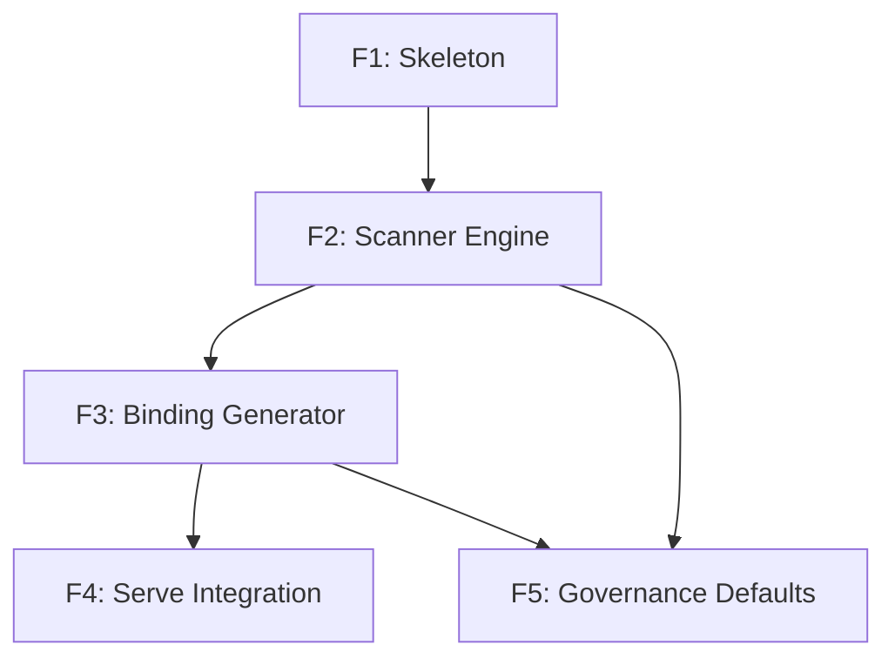

# apexe Feature Specifications -- Overview

| Field | Value |
|-------|-------|
| **Project** | apexe -- Outside-In CLI-to-Agent Bridge |
| **Version** | 0.1.0 |
| **Date** | 2026-03-28 |
| **Status** | SUPERSEDED by [v2-overview.md](v2-overview.md) |

---

## Feature Index

| Feature | Title | Priority | Effort | Dependencies | Spec |
|---------|-------|----------|--------|--------------|------|
| F1 | Project Skeleton & CLI Framework | P0 | Small (~700 LOC) | None | [f1-project-skeleton.md](f1-project-skeleton.md) |
| F2 | CLI Scanner Engine | P0 | Large (~2,500 LOC) | F1 | [f2-cli-scanner-engine.md](f2-cli-scanner-engine.md) |
| F3 | Binding Generator | P0 | Medium (~1,000 LOC) | F2 | [f3-binding-generator.md](f3-binding-generator.md) |
| F4 | Serve Integration | P1 | Small (~400 LOC) | F3 | [f4-serve-integration.md](f4-serve-integration.md) |
| F5 | Governance Defaults | P1 | Medium (~900 LOC) | F2, F3 | [f5-governance-defaults.md](f5-governance-defaults.md) |

## Execution Order

```
Phase 1 (MVP):      F1 -> F2 -> F3 -> F4
Phase 2 (Enterprise): F5
```

## Dependency Graph



## Package Structure

```
apexe/
├── Cargo.toml                   # Package manifest, dependencies, build config
├── src/
│   ├── main.rs                  # Entry point: clap CLI parsing + dispatch
│   ├── lib.rs                   # Library root, re-exports public API
│   ├── cli/                     # CLI commands (F1)
│   │   ├── mod.rs               # Cli struct (clap derive), subcommand dispatch
│   │   ├── scan.rs              # ScanArgs + scan command handler
│   │   ├── serve.rs             # ServeArgs + serve command handler
│   │   ├── list.rs              # ListArgs + list command handler
│   │   └── config_cmd.rs        # ConfigArgs + config command handler
│   ├── config.rs                # Configuration loader (F1)
│   ├── errors.rs                # Error types with thiserror (F1)
│   ├── scanner/                 # CLI Scanner Engine (F2)
│   │   ├── mod.rs
│   │   ├── orchestrator.rs      # ScanOrchestrator: top-level scan coordinator
│   │   ├── resolver.rs          # ToolResolver: binary path resolution
│   │   ├── pipeline.rs          # ParserPipeline: priority-based parser selection
│   │   ├── protocol.rs          # CliParser trait + ParsedHelp struct
│   │   ├── discovery.rs         # SubcommandDiscovery: recursive subcommand scanning
│   │   ├── output_detect.rs     # StructuredOutputDetector
│   │   ├── cache.rs             # ScanCache: filesystem cache for scan results
│   │   └── parsers/             # Built-in parsers
│   │       ├── mod.rs
│   │       ├── gnu.rs           # GNU help format parser
│   │       ├── click_parser.rs  # Click/argparse help format parser
│   │       ├── cobra.rs         # Go Cobra help format parser
│   │       ├── clap_parser.rs   # Rust Clap help format parser
│   │       ├── man.rs           # Man page parser (Tier 2)
│   │       └── completion.rs    # Shell completion parser (Tier 3)
│   ├── models/                  # Shared data types (F2)
│   │   └── mod.rs               # ScannedCLITool, ScannedCommand, ScannedFlag, ScannedArg
│   ├── binding/                 # Binding Generator (F3)
│   │   ├── mod.rs
│   │   ├── binding_gen.rs       # BindingGenerator: ScannedCLITool -> binding YAML
│   │   ├── module_id.rs         # generate_module_id: command path -> cli.tool.cmd
│   │   ├── schema_gen.rs        # SchemaGenerator: flags/args -> JSON Schema
│   │   └── writer.rs            # BindingYAMLWriter: serialize to YAML files
│   ├── executor.rs              # execute_cli(): subprocess execution with injection prevention (F3)
│   ├── serve.rs                 # Serve integration: APCoreMCP + A2A wiring (F4)
│   └── governance/              # Governance Defaults (F5)
│       ├── mod.rs
│       ├── annotations.rs       # infer_annotations: command semantics -> ModuleAnnotations
│       ├── acl.rs               # generate_acl: bindings -> acl.yaml
│       └── audit.rs             # AuditLogger: JSONL audit trail
├── tests/                       # Integration tests
│   ├── cli_tests.rs             # assert_cmd CLI integration tests
│   ├── scan_tests.rs            # Scanner integration tests
│   └── binding_tests.rs         # Binding roundtrip tests
└── docs/
```

## Shared Data Flow

```
CLI Tool Binary
      |
      v
[F2: Scanner Engine] ---> ScannedCLITool
      |
      v
[F3: Binding Generator] ---> *.binding.yaml
      |
      |---> [F5: Governance] ---> annotations + acl.yaml
      v
[F4: Serve Integration] ---> APCoreMCP / A2A Server
```

## Cross-Cutting Concerns

| Concern | Implementation |
|---------|----------------|
| Configuration | `ApexeConfig` struct, resolved from YAML + env + CLI flags (F1) |
| Logging | `tracing` crate with structured fields, `apexe` span hierarchy |
| Error handling | `ApexeError` enum with `thiserror`, `anyhow` for application-level errors |
| Testing | `cargo test` + `rstest` for parameterized, `assert_cmd` for CLI, `tempfile` for temp dirs |
| Linting | `cargo clippy --all-targets -- -D warnings` |
| Formatting | `cargo fmt --all -- --check` |
