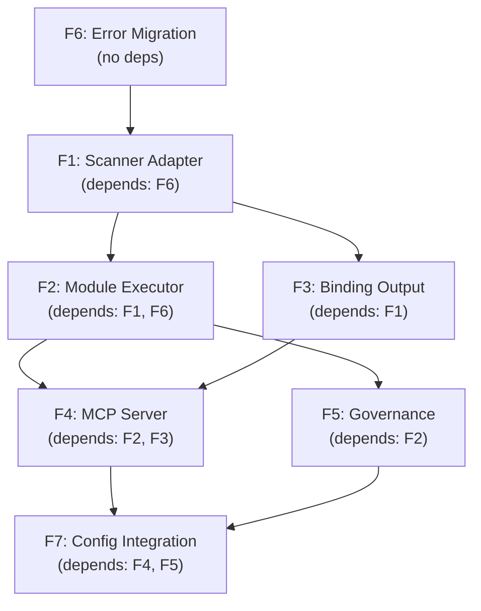

# apexe v0.1.0 Feature Index

| Field | Value |
|---|---|
| **Parent Document** | `docs/apcore-integration/tech-design.md` |
| **Version** | 0.1.0 |
| **Created** | 2026-03-27 |

---

## Feature Summary

| ID | Feature | Status | Priority | Tech Design Section |
|---|---|---|---|---|
| F1 | Scanner Adapter | Planned | P0 (Foundation) | 5.2.1 |
| F2 | Module Executor | Planned | P0 (Core) | 5.6 |
| F3 | Binding Output | Planned | P1 (Output) | 5.3 |
| F4 | MCP Server | Planned | P1 (Serve) | 5.4 |
| F5 | Governance | Planned | P1 (Security) | 5.5 |
| F6 | Error Migration | Planned | P0 (Foundation) | 5.7 |
| F7 | Config Integration | Planned | P2 (Polish) | 5.8 |

---

## Dependency Graph



---

## Execution Order

### Phase 1: Foundation (F6, F1)
No external dependencies. Error migration and scanner adapter can be developed in parallel after F6 lands.

### Phase 2: Core (F2, F3)
F2 (Module Executor) and F3 (Binding Output) can proceed in parallel once F1 is complete.

### Phase 3: Integration (F4, F5)
F4 (MCP Server) requires both F2 and F3. F5 (Governance) requires F2. These can proceed in parallel.

### Phase 4: Polish (F7)
F7 (Config Integration) is the final piece, requiring F4 and F5.

---

## Feature Spec Files

| Feature | Spec File |
|---|---|
| F1: Scanner Adapter | `docs/features/v2-f1-scanner-adapter.md` |
| F2: Module Executor | `docs/features/v2-f2-module-executor.md` |
| F3: Binding Output | `docs/features/v2-f3-binding-output.md` |
| F4: MCP Server | `docs/features/v2-f4-mcp-server.md` |
| F5: Governance | `docs/features/v2-f5-governance.md` |
| F6: Error Migration | `docs/features/v2-f6-error-migration.md` |
| F7: Config Integration | `docs/features/v2-f7-config-integration.md` |

---

## Crate Dependency Map

```
Feature    apcore 0.14    apcore-toolkit 0.4    apcore-mcp 0.11    apcore-cli 0.3
-------    -----------    ------------------    ---------------    --------------
F1                        ScannedModule
F2         Module, Ctx
F3                        YAMLWriter, Verifier
F4         Registry       RegistryWriter        APCoreMCP
F5         ACL, ACLRule                                             AuditLogger, Sandbox
F6         ModuleError
F7         Config                                                   ConfigResolver
```

---

## LOC Impact Estimate

| Category | v0.1.x | v0.1.0 (est) | Delta |
|---|---|---|---|
| Scanner | ~3,200 | ~3,200 | 0 |
| Models | ~475 | ~475 | 0 |
| CLI | ~700 | ~750 | +50 |
| Adapter (new) | 0 | ~600 | +600 |
| Module (new) | 0 | ~500 | +500 |
| Output (new) | 0 | ~400 | +400 |
| Binding (deleted) | ~800 | 0 | -800 |
| Serve (deleted) | ~1,200 | ~100 | -1,100 |
| Governance (rewritten) | ~600 | ~350 | -250 |
| Executor (absorbed) | ~400 | 0 | -400 |
| Errors | ~120 | ~200 | +80 |
| Config | ~110 | ~160 | +50 |
| **Total** | **~7,600** | **~6,200** | **-1,400** |

Test count: ~393 -> ~380 (slight consolidation).
