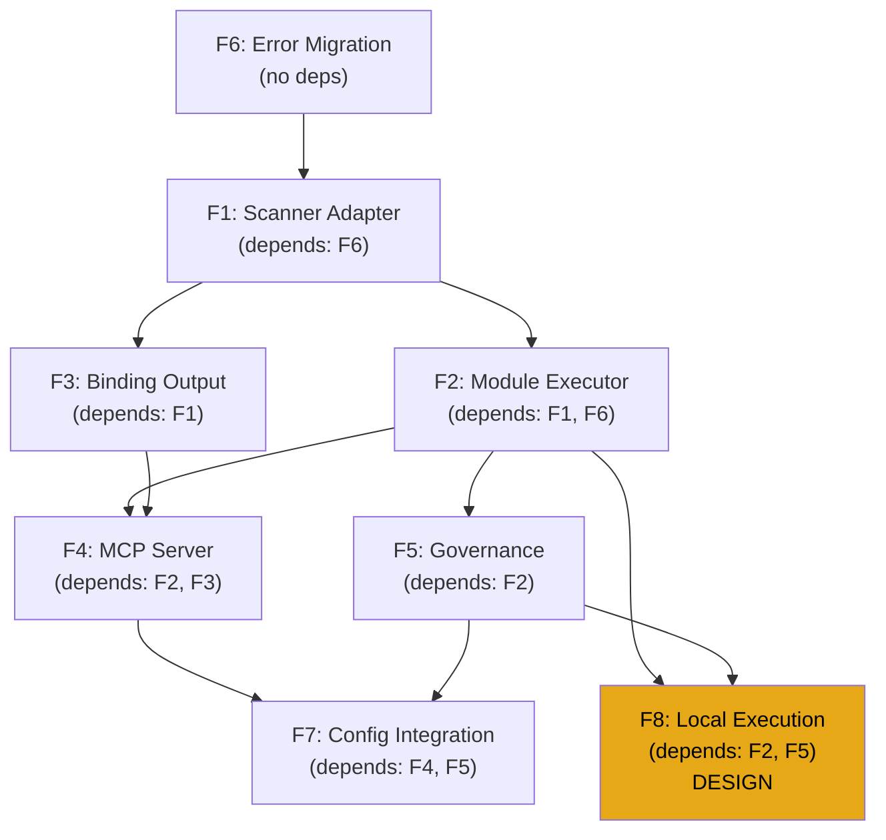

# apexe Feature Index

| Field | Value |
|---|---|
| **Parent Document** | `docs/apcore-integration/tech-design.md` |
| **Created** | 2026-03-27 |
| **Last reviewed** | 2026-09-03, against apexe 0.7.0 |

> **What these documents are.** F1–F7 were written before implementation, in
> March 2026, and describe the apcore-integration work that shipped across
> 0.2.0–0.7.0. They are kept as the record of *why* each piece is shaped the way
> it is, annotated where the build diverged. They are **not** a current
> architecture reference — for that read [`docs/user-manual.md`](../user-manual.md),
> [`docs/threat-model.md`](../threat-model.md) and
> [`docs/FEATURE_MANIFEST.md`](../FEATURE_MANIFEST.md), which describe the code
> as it stands.
>
> F8 is different: it is an *active* design for work not yet built.

---

## Feature Summary

| ID | Feature | Status | Priority | Tech Design Section |
|---|---|---|---|---|
| F1 | Scanner Adapter | Implemented | P0 (Foundation) | 5.2.1 |
| F2 | Module Executor | Implemented | P0 (Core) | 5.6 |
| F3 | Binding Output | Implemented | P1 (Output) | 5.3 |
| F4 | MCP Server | Implemented | P1 (Serve) | 5.4 |
| F5 | Governance | Implemented | P1 (Security) | 5.5 |
| F6 | Error Migration | Implemented | P0 (Foundation) | 5.7 |
| F7 | Config Integration | Implemented | P2 (Polish) | 5.8 |
| F8 | Local Execution | **Design** — Stage 1 ready to build, Stage 2 blocked | P1 (Surface) | — (post-dates the tech design) |

Three features shipped materially differently from their spec, and each spec
says so inline: F3 never built `RegistryOutput` (registration is
`module::build_executor`, reading bindings from disk); F4's authentication
became a first-class CLI flag set rather than a library-API concern; F5 replaced
the planned `SandboxManager` with always-on isolation in the executor, and its
audit trail is apexe's own rather than a wrapper around `apcore_cli::AuditLogger`.

Governance also grew past F5's scope after it shipped — the always-on path guard
and per-call approval escalation are documented in the user manual §9.6–§9.7 and
the threat model §4.8–§4.9, not here.

---

## Dependency Graph


```mermaid
graph TD
    F6["F6: Error Migration<br/>(no deps)"]
    F1["F1: Scanner Adapter<br/>(depends: F6)"]
    F2["F2: Module Executor<br/>(depends: F1, F6)"]
    F3["F3: Binding Output<br/>(depends: F1)"]
    F4["F4: MCP Server<br/>(depends: F2, F3)"]
    F5["F5: Governance<br/>(depends: F2)"]
    F7["F7: Config Integration<br/>(depends: F4, F5)"]
    F8["F8: Local Execution<br/>(depends: F2, F5)<br/>DESIGN"]

    F6 --> F1
    F1 --> F2
    F1 --> F3
    F2 --> F4
    F3 --> F4
    F2 --> F5
    F4 --> F7
    F5 --> F7
    F2 --> F8
    F5 --> F8

    style F8 fill:#e6a817,color:#000
```

---

## Execution Order

F1–F7 are complete; the phases below record the order they were built in.

### Phase 1: Foundation (F6, F1)
No external dependencies. Error migration and scanner adapter developed in parallel after F6 landed.

### Phase 2: Core (F2, F3)
F2 (Module Executor) and F3 (Binding Output) proceeded in parallel once F1 was complete.

### Phase 3: Integration (F4, F5)
F4 (MCP Server) required both F2 and F3. F5 (Governance) required F2.

### Phase 4: Polish (F7)
F7 (Config Integration) was the last of the original set, requiring F4 and F5.

### Next: F8 (not started)
Stage 1 (`apexe run` plus a preflight that reports every governance decision)
reuses the executor as it stands and can be built now. Stage 2 (PATH shims) is
blocked on two contracts the spec requires settling first: an `ExecutionIo` mode
for passthrough I/O, and a `streaming_stdin_safe` per-module allowlist. See
[F8 §10](v2-f8-local-execution.md) for the delivery plan.

---

## Feature Spec Files

| Feature | Spec File |
|---|---|
| F1: Scanner Adapter | `docs/features/v2-f1-scanner-adapter.md` |
| F2: Module Executor | `docs/features/v2-f2-module-executor.md` |
| F3: Binding Output | `docs/features/v2-f3-binding-output.md` |
| F4: MCP Server | `docs/features/v2-f4-mcp-server.md` |
| F5: Governance | `docs/features/v2-f5-governance.md` |
| F6: Error Migration | `docs/features/v2-f6-error-migration.md` |
| F7: Config Integration | `docs/features/v2-f7-config-integration.md` |
| F8: Local Execution | `docs/features/v2-f8-local-execution.md` |

---

## Crate Dependency Map

Versions as of apexe 0.7.0. The 2026-03 drafts of F1–F7 were written against
apcore 0.14, apcore-toolkit 0.4, apcore-mcp 0.11 and apcore-cli 0.3; several
type and `ErrorCode` names changed across those upgrades, and each spec notes
the renames where they matter.

```
Feature   apcore 0.28    apcore-toolkit 0.10   apcore-mcp 0.19   apcore-a2a 0.6   apcore-cli 0.11
-------   -----------    -------------------   ---------------   --------------   ---------------
F1                       ScannedModule,
                         deduplicate_ids
F2        Module, Context
F3                       YAMLWriter,
                         YAMLVerifier,
                         DisplayResolver
F4        Registry,      RegistryWriter        APCoreMCP,        async_serve,
          Executor                             ElicitCallback    build_app
F5        ACL, ACLRule,                        ApprovalHandler,
          AuditEntry                           ApprovalStore
F6        ModuleError,
          ErrorCode
F7        Config
F8        Executor                                                                (none yet)
```

`apcore-cli` contributes only `build_program_man_page` for `apexe --man`. F5's
draft planned to use its `AuditLogger` and `Sandbox`; neither was adopted — see
F5 §4 and §5.

---

## LOC Impact Estimate (2026-03 projection, kept for the record)

This was the estimate made before implementation. It is **not** a description of
the current tree, which is roughly 36,000 lines across `src/` — the difference
is overlays, the path guard, approval, resilience middleware, A2A and the
contract layer, none of which were in scope in March.

| Category | v0.1.x | v0.2.0 (est) | Delta |
|---|---|---|---|
| Scanner | ~3,200 | ~3,200 | 0 |
| Models | ~475 | ~475 | 0 |
| CLI | ~700 | ~750 | +50 |
| Adapter (new) | 0 | ~600 | +600 |
| Module (new) | 0 | ~500 | +500 |
| Output (new) | 0 | ~400 | +400 |
| Binding (deleted) | ~800 | 0 | -800 |
| Serve (deleted) | ~1,200 | ~100 | -1,100 |
| Governance (rewritten) | ~600 | ~350 | -250 |
| Executor (absorbed) | ~400 | 0 | -400 |
| Errors | ~120 | ~200 | +80 |
| Config | ~110 | ~160 | +50 |
| **Total** | **~7,600** | **~6,200** | **-1,400** |

Projected test count was ~380. Run `cargo test --all-features` for the real one.
