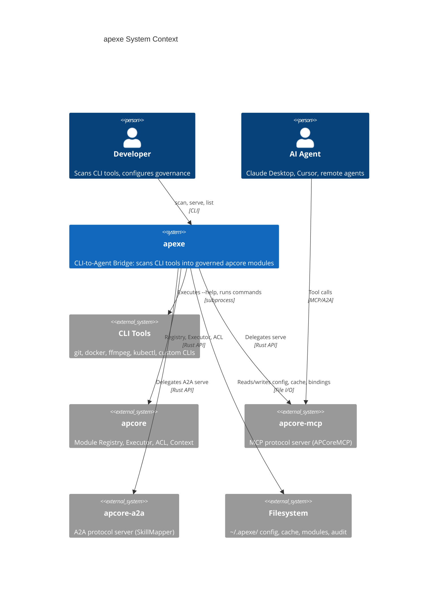
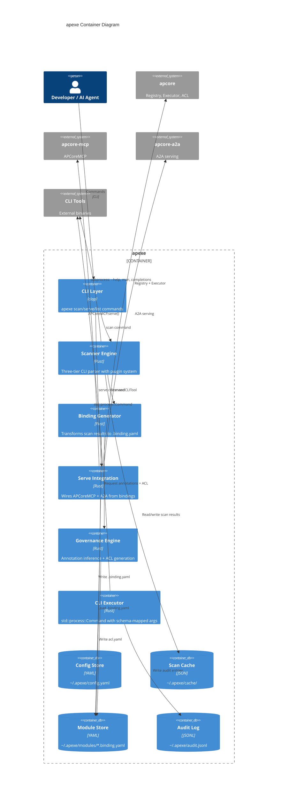
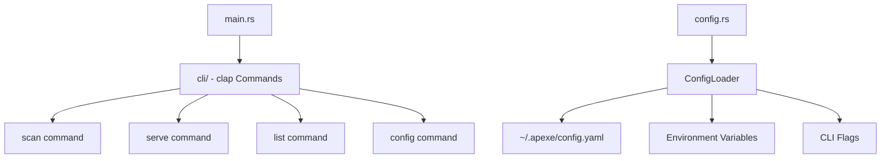
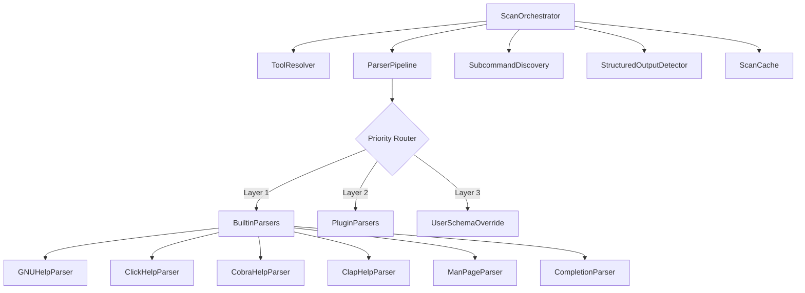
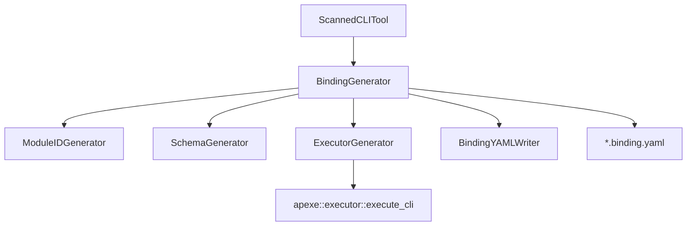
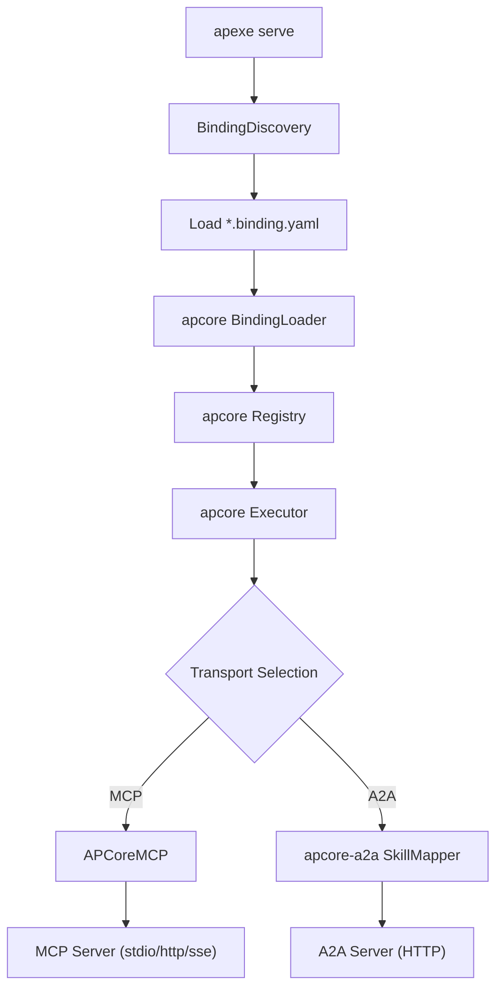
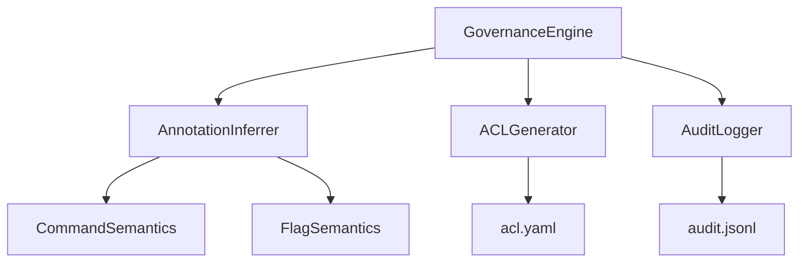
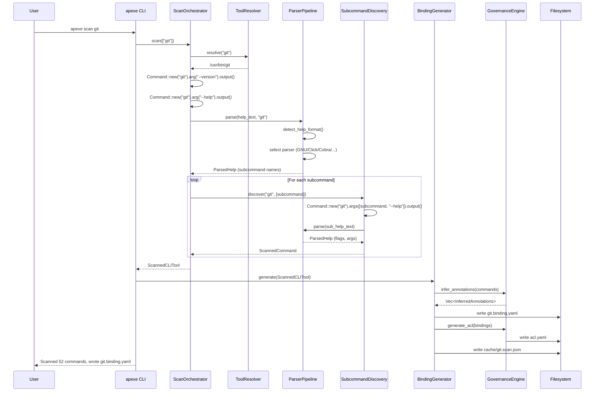
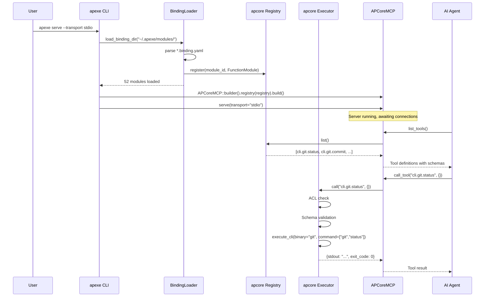
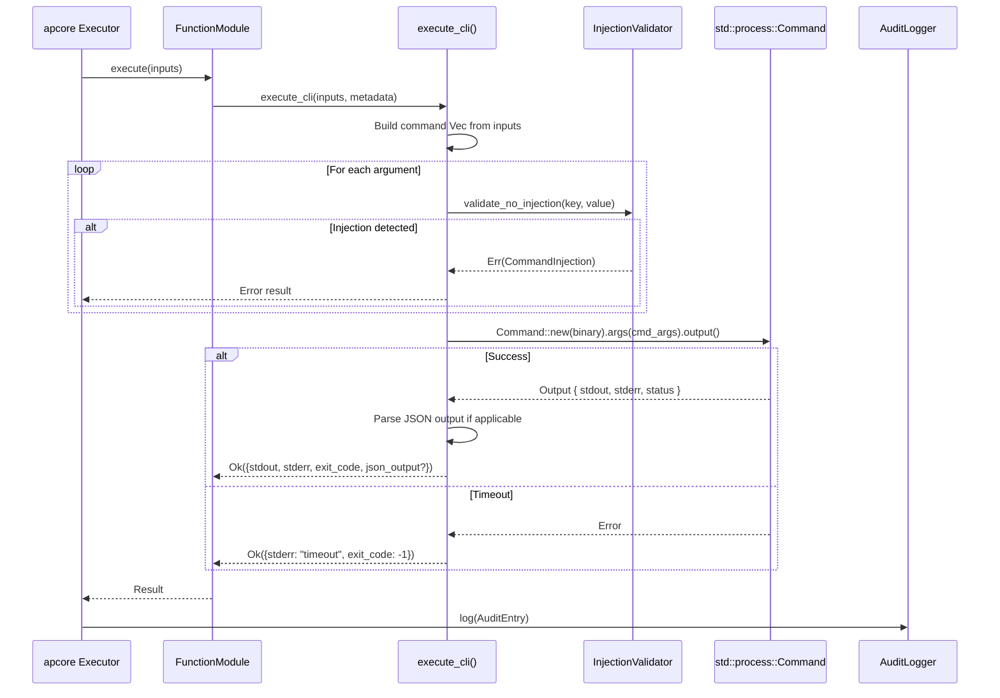

# Technical Design Document: apexe

| Field | Value |
|-------|-------|
| **Title** | apexe -- Outside-In CLI-to-Agent Bridge |
| **Authors** | AIPartnerUp Engineering |
| **Status** | DRAFT |
| **Date** | 2026-03-21 |
| **Version** | 0.1.0 |
| **Spec Version** | apcore 1.5.0-draft |

---

## 1. Executive Summary

**apexe** is a Rust CLI tool that automatically wraps arbitrary command-line tools into governed apcore modules, served via MCP and A2A protocols. It solves the critical gap where AI agents (Claude Code, Cursor, Gemini CLI) execute CLI commands with zero governance -- no schema enforcement, no behavioral annotations, no ACL, and no remote serving capability. apexe uses a purely deterministic, three-tier scanning engine (`--help` parsing, man page parsing, shell completion parsing) with a plugin system for extensibility, generating `.binding.yaml` files that integrate directly into the apcore ecosystem. The result: `apexe scan git && apexe serve` transforms any CLI tool into a schema-enforced, ACL-governed MCP/A2A server in seconds.

---

## 2. Background & Motivation

### 2.1 Problem Statement

AI agents today execute CLI commands as raw strings with no structured understanding of the tools they invoke. This creates four compounding problems:

1. **No Schema enforcement** -- Agents guess flags and parameters, leading to hallucinated flags and failed executions.
2. **No behavioral annotations** -- Agents cannot distinguish `rm -rf /` from `ls`, treating all commands as equally safe.
3. **No ACL or audit trails** -- Every command runs with the full permissions of the host user, with no record of what was executed or by whom.
4. **No remote serving** -- CLI tools are inherently local; there is no standard way to expose them to remote agents.

### 2.2 Why Now

| Signal | Evidence |
|--------|----------|
| CLI-Anything | 20,148 GitHub stars in 13 days -- explosive demand for "CLI agent-ification" |
| MCP ecosystem | 73,284 GitHub repos, but zero "CLI-to-MCP auto-generator" tools |
| EU AI Act | August 2026 compliance deadline requires tool invocation governance |
| Competitive gap | No tool combines CLI scanning + schema enforcement + MCP/A2A serving + ACL governance |

### 2.3 Competitive Landscape

| Capability | CLI-Anything | mcpo | FastMCP | cli-mcp-server | **apexe** |
|------------|-------------|------|---------|----------------|-----------|
| Auto-generate from CLI | Yes (LLM) | No | No | No | **Yes (deterministic)** |
| MCP protocol | No | Proxy | Native | Native | **Native (via apcore-mcp)** |
| A2A protocol | No | No | No | No | **Yes (via apcore-a2a)** |
| ACL governance | No | API key | No | Allowlist | **apcore ACL** |
| Behavioral annotations | No | No | No | No | **Yes** |
| Audit trails | No | No | No | No | **Yes** |
| Structured output | JSON flag | OpenAPI | Schema | Raw stdout | **JSON Schema enforced** |
| Remote serve | No | Yes | Yes | No | **Yes** |
| Parser extensibility | No | N/A | N/A | N/A | **Plugin system** |

---

## 3. Goals & Non-Goals

### 3.1 Goals

| ID | Goal | Traceability |
|----|------|--------------|
| G1 | Scan any CLI tool's `--help`/man pages into structured metadata deterministically | F2 |
| G2 | Generate `.binding.yaml` files loadable by apcore `BindingLoader` | F3 |
| G3 | Serve scanned CLI tools as MCP/A2A endpoints via `APCoreMCP` and `apcore-a2a` | F4 |
| G4 | Auto-infer behavioral annotations and generate default ACL rules | F5 |
| G5 | Support a plugin system for custom CLI help format parsers | F2 |
| G6 | Use `cli.` namespace prefix for all generated module IDs | F3 |
| G7 | Prevent command injection in subprocess execution | F3 |

### 3.2 Non-Goals

| ID | Non-Goal | Rationale |
|----|----------|-----------|
| NG1 | LLM-assisted CLI parsing | Deterministic parsing avoids cost, latency, and non-reproducibility |
| NG2 | Docker/firejail sandboxing | Deferred to Phase 2 |
| NG3 | `apexe evo` (runtime module generation) | Future product capability, out of scope for v1 |
| NG4 | GUI or web-based configuration | CLI-first approach matches developer workflow |
| NG5 | Windows support | Phase 1 targets macOS/Linux only |

---

## 4. Design Inputs

### 4.1 Requirements Traceability

| Requirement | Source | Feature |
|-------------|--------|---------|
| Clap-based CLI with `scan`, `serve`, `list` commands | User Req #1 | F1 |
| Three-layer parser priority (built-in > plugin > user override) | User Req #2 | F2 |
| Three-tier scanning: `--help`, man pages, shell completions | User Req #3 | F2 |
| `std::process::Command` execution (Phase 1) | User Req #4 | F3 |
| Structured output detection (`--format json`) | User Req #5 | F2, F3 |
| Delegate serving to `APCoreMCP` / `apcore-a2a` | User Req #6 | F4 |
| `cli.` module ID prefix | User Req #7 | F3 |
| Annotation inference from command semantics | User Req #8 | F5 |
| ~5,500 LOC total across 5 features | User Req #9 | All |

### 4.2 Feature Summary

| Feature | Priority | Effort | Dependencies |
|---------|----------|--------|--------------|
| F1: Project Skeleton & CLI Framework | P0 | Small (~700 LOC) | None |
| F2: CLI Scanner Engine | P0 | Large (~2,500 LOC) | F1 |
| F3: Binding Generator | P0 | Medium (~1,000 LOC) | F2 |
| F4: Serve Integration | P1 | Small (~400 LOC) | F3 |
| F5: Governance Defaults | P1 | Medium (~900 LOC) | F2, F3 |

---

## 5. User Scenarios

### 5.1 Developer: Quick MCP Server from Git

**Persona:** Solo developer using Claude Desktop for code review.

1. Developer installs apexe: `cargo install apexe`
2. Scans git: `apexe scan git`
3. Reviews generated modules: `apexe list`
4. Starts MCP server: `apexe serve --transport stdio`
5. Adds to Claude Desktop config:
   ```json
   {
     "mcpServers": {
       "apexe": {
         "command": "apexe",
         "args": ["serve", "--transport", "stdio"]
       }
     }
   }
   ```
6. Claude Desktop now has schema-enforced access to `cli.git.status`, `cli.git.commit`, `cli.git.log`, etc.
7. Claude correctly uses `--message` flag (not hallucinated `--msg`) because the schema defines it.

### 5.2 Enterprise: Governed CLI Access for AI Agents

**Persona:** Platform engineer at a financial services company.

1. Engineer scans internal deployment CLI: `apexe scan deploy-tool --output-dir /opt/apexe/modules`
2. Reviews auto-generated governance: `cat ~/.apexe/acl.yaml`
   - `deploy-tool rollback` is annotated `destructive: true, requires_approval: true`
   - `deploy-tool status` is annotated `readonly: true`
3. Customizes ACL to restrict destructive operations to `ops-team` role
4. Starts governed server: `apexe serve --transport http --port 8000 --a2a`
5. AI agents can invoke `cli.deploy_tool.status` freely but `cli.deploy_tool.rollback` requires human approval
6. Every invocation is logged to `~/.apexe/audit.jsonl` for compliance

### 5.3 Multi-Agent: Remote A2A Tool Sharing

**Persona:** DevOps team with multiple AI agents across machines.

1. Team scans Docker and kubectl: `apexe scan docker kubectl`
2. Serves over HTTP with A2A: `apexe serve --transport http --port 9000 --a2a`
3. Remote agents discover capabilities via `/.well-known/agent.json`
4. Agent A (code review) calls `cli.docker.build` on the build server
5. Agent B (deployment) calls `cli.kubectl.apply` on the staging server
6. Both agents operate within schema constraints and ACL rules

### 5.4 Custom CLI: Plugin Parser for Proprietary Tool

**Persona:** Developer with a non-standard internal CLI tool.

1. Tool's `--help` output uses a proprietary format that built-in parsers cannot handle
2. Developer writes a parser plugin as a shared library implementing the `CliParser` trait:
   ```rust
   use apexe::scanner::protocol::{CliParser, ParsedHelp};

   pub struct MyToolParser;

   impl CliParser for MyToolParser {
       fn name(&self) -> &str { "mytool-parser" }
       fn priority(&self) -> u32 { 200 }

       fn can_parse(&self, help_text: &str, _tool_name: &str) -> bool {
           help_text.contains("MyTool v")
       }

       fn parse(&self, help_text: &str, _tool_name: &str) -> anyhow::Result<ParsedHelp> {
           // Custom parsing logic
           todo!()
       }
   }
   ```
3. Places plugin `.so`/`.dylib` in `~/.apexe/plugins/` or registers via config
4. `apexe scan mytool` automatically discovers and uses the custom parser
5. Generated `.binding.yaml` works identically to built-in parsed tools

---

## 6. System Architecture

### 6.1 C4 Context Diagram



### 6.2 C4 Container Diagram



---

## 7. Detailed Design

### 7.1 F1: Project Skeleton & CLI Framework

#### 7.1.1 Component Overview



#### 7.1.2 Data Models

```rust
use std::path::PathBuf;

use serde::{Deserialize, Serialize};

/// Global configuration resolved from file, env vars, and CLI flags.
///
/// Resolution priority: CLI flags > env vars > config file > defaults.
#[derive(Debug, Clone, Serialize, Deserialize)]
pub struct ApexeConfig {
    pub modules_dir: PathBuf,
    pub cache_dir: PathBuf,
    pub config_dir: PathBuf,
    pub audit_log: PathBuf,
    pub log_level: String,
    pub default_timeout: u64,
    pub scan_depth: u32,
    pub json_output_preference: bool,
}

impl Default for ApexeConfig {
    fn default() -> Self {
        let home = dirs::home_dir().unwrap_or_else(|| PathBuf::from("."));
        let apexe_dir = home.join(".apexe");
        Self {
            modules_dir: apexe_dir.join("modules"),
            cache_dir: apexe_dir.join("cache"),
            config_dir: apexe_dir.clone(),
            audit_log: apexe_dir.join("audit.jsonl"),
            log_level: "info".to_string(),
            default_timeout: 30,
            scan_depth: 2,
            json_output_preference: true,
        }
    }
}

impl ApexeConfig {
    /// Create all required directories if they do not exist.
    pub fn ensure_dirs(&self) -> std::io::Result<()> {
        std::fs::create_dir_all(&self.modules_dir)?;
        std::fs::create_dir_all(&self.cache_dir)?;
        std::fs::create_dir_all(&self.config_dir)?;
        Ok(())
    }
}
```

#### 7.1.3 CLI Commands

| Command | Signature | Description |
|---------|-----------|-------------|
| `apexe scan` | `apexe scan <tool> [<tool>...] [--output-dir PATH] [--depth N] [--no-cache] [--format json\|yaml\|table]` | Scan one or more CLI tools |
| `apexe serve` | `apexe serve [--transport stdio\|http\|sse] [--host HOST] [--port PORT] [--a2a] [--explorer] [--modules-dir PATH]` | Start MCP/A2A server |
| `apexe list` | `apexe list [--format json\|table] [--modules-dir PATH]` | List previously scanned tools |
| `apexe config` | `apexe config [--show\|--init]` | Show or initialize configuration |

#### 7.1.4 Entry Point

```rust
// src/main.rs
use clap::Parser;
use tracing_subscriber::EnvFilter;

use apexe::cli::Cli;

fn main() -> anyhow::Result<()> {
    let cli = Cli::parse();

    tracing_subscriber::fmt()
        .with_env_filter(
            EnvFilter::try_from_default_env()
                .unwrap_or_else(|_| EnvFilter::new(&cli.log_level)),
        )
        .init();

    cli.run()
}
```

#### 7.1.5 Error Handling

| Error | Exit Code | Description |
|-------|-----------|-------------|
| Invalid arguments | 2 | clap handles argument validation |
| Tool not found | 1 | `<tool>` binary not on `$PATH` |
| Config file malformed | 1 | YAML parse error in `~/.apexe/config.yaml` |
| Permission denied | 1 | Cannot create `~/.apexe/` directories |

---

### 7.2 F2: CLI Scanner Engine

#### 7.2.1 Component Overview



#### 7.2.2 Data Models

```rust
use serde::{Deserialize, Serialize};

/// Type classification for CLI flag/argument values.
#[derive(Debug, Clone, Copy, PartialEq, Eq, Serialize, Deserialize)]
#[serde(rename_all = "lowercase")]
pub enum ValueType {
    String,
    Integer,
    Float,
    Boolean,
    Path,
    Enum,
    Url,
    Unknown,
}

/// Detected help output format.
#[derive(Debug, Clone, Copy, PartialEq, Eq, Serialize, Deserialize)]
#[serde(rename_all = "lowercase")]
pub enum HelpFormat {
    Gnu,
    Click,
    Argparse,
    Cobra,
    Clap,
    Unknown,
}

/// A single CLI flag parsed from help output.
#[derive(Debug, Clone, Serialize, Deserialize)]
pub struct ScannedFlag {
    /// Long form flag (e.g., "--message"). None if only short form exists.
    pub long_name: Option<String>,
    /// Short form flag (e.g., "-m"). None if only long form exists.
    pub short_name: Option<String>,
    /// Human-readable description from help text.
    pub description: String,
    /// Inferred type of the flag's value.
    pub value_type: ValueType,
    /// Whether the flag is required.
    pub required: bool,
    /// Default value as string, or None.
    pub default: Option<String>,
    /// Possible values for enum-type flags.
    pub enum_values: Option<Vec<String>>,
    /// Whether the flag can be specified multiple times.
    pub repeatable: bool,
    /// Placeholder name for the value (e.g., "FILE", "NUM").
    pub value_name: Option<String>,
}

impl ScannedFlag {
    /// Return the preferred flag name for use as a schema property key.
    /// Long form preferred, stripped of leading dashes, hyphens replaced with underscores.
    pub fn canonical_name(&self) -> String {
        if let Some(ref long) = self.long_name {
            long.trim_start_matches('-').replace('-', "_")
        } else if let Some(ref short) = self.short_name {
            short.trim_start_matches('-').to_string()
        } else {
            "unknown".to_string()
        }
    }
}

/// A positional argument parsed from help output.
#[derive(Debug, Clone, Serialize, Deserialize)]
pub struct ScannedArg {
    /// Argument name (e.g., "FILE", "PATH").
    pub name: String,
    /// Human-readable description.
    pub description: String,
    /// Inferred type.
    pub value_type: ValueType,
    /// Whether the argument is required.
    pub required: bool,
    /// Whether the argument accepts multiple values.
    pub variadic: bool,
}

/// Information about a CLI tool's structured output capability.
#[derive(Debug, Clone, Default, Serialize, Deserialize)]
pub struct StructuredOutputInfo {
    /// Whether the tool supports structured output.
    pub supported: bool,
    /// The flag to enable structured output (e.g., "--format json").
    pub flag: Option<String>,
    /// The output format (e.g., "json", "csv", "xml").
    pub format: Option<String>,
}

/// A single CLI command or subcommand with its parsed metadata.
#[derive(Debug, Clone, Serialize, Deserialize)]
pub struct ScannedCommand {
    /// Command name (e.g., "commit").
    pub name: String,
    /// Full command path (e.g., "git commit").
    pub full_command: String,
    /// Human-readable description.
    pub description: String,
    /// Parsed flags/options.
    pub flags: Vec<ScannedFlag>,
    /// Parsed positional arguments.
    pub positional_args: Vec<ScannedArg>,
    /// Nested subcommands.
    pub subcommands: Vec<ScannedCommand>,
    /// Example invocations from help text.
    pub examples: Vec<String>,
    /// Detected format of the help output.
    pub help_format: HelpFormat,
    /// Structured output capability info.
    pub structured_output: StructuredOutputInfo,
    /// Original help text (preserved for debugging).
    pub raw_help: String,
}

/// Complete scan result for a single CLI tool.
#[derive(Debug, Clone, Serialize, Deserialize)]
pub struct ScannedCLITool {
    /// Tool binary name (e.g., "git").
    pub name: String,
    /// Absolute path to the binary.
    pub binary_path: String,
    /// Version string from --version, or None.
    pub version: Option<String>,
    /// Tree of discovered commands.
    pub subcommands: Vec<ScannedCommand>,
    /// Flags available on all subcommands.
    pub global_flags: Vec<ScannedFlag>,
    /// Global structured output capability.
    pub structured_output: StructuredOutputInfo,
    /// Highest tier used during scanning (1=help, 2=man, 3=completion).
    pub scan_tier: u32,
    /// Non-fatal issues encountered during scanning.
    pub warnings: Vec<String>,
}
```

#### 7.2.3 Parser Plugin Trait

```rust
use crate::models::{ScannedArg, ScannedFlag, StructuredOutputInfo};

/// Result of parsing a single help text block.
#[derive(Debug, Clone, Default, Serialize, Deserialize)]
pub struct ParsedHelp {
    /// Extracted command description.
    pub description: String,
    /// Parsed flag definitions.
    pub flags: Vec<ScannedFlag>,
    /// Parsed positional argument definitions.
    pub positional_args: Vec<ScannedArg>,
    /// Names of discovered subcommands (for recursive scanning).
    pub subcommand_names: Vec<String>,
    /// Example invocations.
    pub examples: Vec<String>,
    /// Detected structured output support.
    pub structured_output: StructuredOutputInfo,
}

/// Trait for CLI help format parser plugins.
///
/// Implementations are discovered via dynamic library loading
/// from `~/.apexe/plugins/` or registered programmatically.
pub trait CliParser: Send + Sync {
    /// Human-readable parser name (e.g., "terraform-parser").
    fn name(&self) -> &str;

    /// Parser priority (lower = higher priority). Built-in parsers use 100-199.
    /// Plugin parsers should use 200-299. Range 0-99 is reserved for user overrides.
    fn priority(&self) -> u32;

    /// Return true if this parser can handle the given help text.
    fn can_parse(&self, help_text: &str, tool_name: &str) -> bool;

    /// Parse help text into structured metadata.
    ///
    /// Returns `Ok(ParsedHelp)` on success, or an error if parsing fails
    /// despite `can_parse()` returning true.
    fn parse(&self, help_text: &str, tool_name: &str) -> anyhow::Result<ParsedHelp>;
}
```

#### 7.2.4 Plugin Discovery

Plugins are discovered via shared library loading or built-in registration:

```rust
use std::path::Path;

use tracing::{info, warn};

use crate::scanner::protocol::CliParser;

/// Discover parser plugins from the plugins directory.
///
/// Looks for shared libraries (`.so` on Linux, `.dylib` on macOS) in
/// `~/.apexe/plugins/` that export a `create_parser` function.
///
/// Returns a list of `Box<dyn CliParser>` sorted by priority (ascending).
pub fn discover_parser_plugins(plugins_dir: &Path) -> Vec<Box<dyn CliParser>> {
    let mut plugins: Vec<Box<dyn CliParser>> = Vec::new();

    if !plugins_dir.is_dir() {
        return plugins;
    }

    let entries = match std::fs::read_dir(plugins_dir) {
        Ok(entries) => entries,
        Err(e) => {
            warn!("Failed to read plugins directory: {e}");
            return plugins;
        }
    };

    for entry in entries.flatten() {
        let path = entry.path();
        let ext = path.extension().and_then(|e| e.to_str());
        let is_lib = matches!(ext, Some("so" | "dylib"));
        if !is_lib {
            continue;
        }

        match load_plugin(&path) {
            Ok(parser) => {
                info!(
                    name = parser.name(),
                    priority = parser.priority(),
                    "Loaded parser plugin"
                );
                plugins.push(parser);
            }
            Err(e) => {
                warn!(path = %path.display(), "Failed to load parser plugin: {e}");
            }
        }
    }

    plugins.sort_by_key(|p| p.priority());
    plugins
}

/// Load a single parser plugin from a shared library.
///
/// The library must export a `create_parser` function with signature:
/// `extern "C" fn() -> Box<dyn CliParser>`
fn load_plugin(path: &Path) -> anyhow::Result<Box<dyn CliParser>> {
    // In production, use libloading to dlopen the shared library.
    // For safety, the plugin ABI contract must be versioned.
    anyhow::bail!("Dynamic plugin loading not yet implemented for {}", path.display())
}
```

#### 7.2.5 Three-Layer Priority System

```
User Schema Override (priority 0-99)
        |
        v  (if no override)
Plugin Parsers (priority 200-299, discovered via shared libraries)
        |
        v  (if no plugin matches)
Built-in Parsers (priority 100-199)
        |
        v  (if no parser matches)
Fallback: return raw help text as description, no flags parsed
```

The `ParserPipeline` iterates parsers in priority order. For each `--help` output:

1. Check if user provided a `.binding.yaml` override for this tool -- if so, skip parsing entirely.
2. Call `can_parse()` on each plugin parser (sorted by priority). Use the first match.
3. If no plugin matches, call `can_parse()` on built-in parsers. Use the first match.
4. If nothing matches, produce a `ScannedCommand` with raw help text as the description.

#### 7.2.6 Key Algorithms

##### Help Format Detection

```rust
/// Detect the CLI framework that generated the help text.
///
/// Heuristics:
///   - Click/argparse: 'Usage: <name> [OPTIONS]', 'Options:' section with
///     indented '--flag  Description' lines
///   - GNU: 'Usage: <name> [OPTION]...', long descriptions with
///     '  -f, --flag=VALUE  Description' format
///   - Cobra (Go): 'Usage:\n  <name> [command]', 'Available Commands:' section
///   - Clap (Rust): 'Usage: <name> [OPTIONS]', 'Options:' with
///     '  -f, --flag <VALUE>  Description' format
pub fn detect_help_format(help_text: &str) -> HelpFormat {
    if help_text.contains("Available Commands:") || help_text.contains("Flags:") {
        HelpFormat::Cobra
    } else if help_text.contains("SUBCOMMANDS:") {
        HelpFormat::Clap
    } else if help_text.contains("[OPTIONS]") && help_text.contains("Commands:") {
        HelpFormat::Click
    } else if help_text.contains("Usage:") {
        HelpFormat::Gnu
    } else {
        HelpFormat::Unknown
    }
}
```

##### GNU Help Parser (representative algorithm)

```
Algorithm: parse_gnu_help(help_text)

Input:
  help_text -- Raw --help output in GNU format

Output:
  ParsedHelp with flags, args, subcommands

Steps:
  1. Extract description: first non-empty paragraph before "Usage:" or "Options:"
  2. Locate OPTIONS section (line matching /^(Options|FLAGS|optional arguments):/i)
  3. For each option line (matching /^\s{2,}-/):
     a. Extract short flag: match /-([a-zA-Z0-9]),?\s/
     b. Extract long flag: match /--([a-z][a-z0-9-]*)/
     c. Extract value placeholder: match /[=\s]([A-Z_]+|<[^>]+>)/
     d. Determine if boolean: no value placeholder = boolean flag
     e. Detect enum: description contains '{val1,val2,...}' or 'one of: val1, val2'
     f. Detect default: description contains '[default: X]' or '(default X)'
     g. Detect required: description contains 'required' or flag listed in SYNOPSIS without []
     h. Detect repeatable: description contains 'can be repeated' or flag shows '...'
     i. Infer value_type from placeholder name:
        - FILE, PATH, DIR -> ValueType::Path
        - NUM, NUMBER, COUNT, N -> ValueType::Integer
        - URL -> ValueType::Url
        - others -> ValueType::String
  4. Locate COMMANDS/SUBCOMMANDS section
  5. For each command line (matching /^\s{2,}([a-z][\w-]*)\s+(.+)/):
     a. Extract command name and description
  6. Detect structured output flags:
     a. Look for flags like --format, --output, -o with enum values containing 'json'
     b. Look for flags like --json
  7. Return ParsedHelp
```

##### GNU Flag Extraction with nom

```rust
use nom::{
    bytes::complete::{tag, take_while1},
    character::complete::{char, multispace0, space1},
    combinator::{opt, map},
    sequence::{preceded, tuple},
    IResult,
};

/// Parse a single GNU-style option line:
///   "  -m, --message=MSG   Use the given message"
///   "  -a, --all           Commit all changed files"
fn parse_flag_line(input: &str) -> IResult<&str, (Option<&str>, Option<&str>, Option<&str>, &str)> {
    let (input, _) = multispace0(input)?;

    // Parse optional short flag: -X
    let (input, short) = opt(preceded(
        char('-'),
        take_while1(|c: char| c.is_alphanumeric()),
    ))(input)?;

    // Skip optional comma separator
    let (input, _) = opt(tuple((char(','), space1)))(input)?;

    // Parse optional long flag: --flag-name
    let (input, long) = opt(preceded(
        tag("--"),
        take_while1(|c: char| c.is_alphanumeric() || c == '-'),
    ))(input)?;

    // Parse optional value placeholder: =VALUE or <VALUE>
    let (input, value_name) = opt(preceded(
        opt(char('=')),
        take_while1(|c: char| c.is_uppercase() || c == '_' || c == '<' || c == '>'),
    ))(input)?;

    // Skip whitespace before description
    let (input, _) = space1(input)?;

    // Remaining text is the description
    let description = input.trim();

    Ok(("", (short, long, value_name, description)))
}
```

##### Subcommand Discovery (Recursive Scanning)

```
Algorithm: discover_subcommands(tool_name, parent_command, max_depth)

Input:
  tool_name -- Binary name
  parent_command -- Full command prefix (e.g., "git remote")
  max_depth -- Maximum recursion depth (default: 3)

Output:
  Vec<ScannedCommand>

Steps:
  1. Run: Command::new(tool_name).args(parent_args).arg("--help")
         .output() with timeout via wait_with_output
  2. Parse help output to extract subcommand names
  3. For each subcommand:
     a. If depth < max_depth:
        - Recursively call discover_subcommands(tool_name, parent + subcommand, depth+1)
     b. Run: Command::new(tool_name).args(parent_args).args([subcommand, "--help"]).output()
     c. Parse the subcommand's help output for flags and args
  4. Return Vec<ScannedCommand>
```

##### Structured Output Detection

```rust
/// Patterns that indicate JSON output support.
const JSON_OUTPUT_PATTERNS: &[(&str, &str)] = &[
    (r"--format\b", "--format json"),
    (r"--output-format\b", "--output-format json"),
    (r"-o\s+json\b|--output\s+json\b", "-o json"),
    (r"--json\b", "--json"),
    (r"-j\b", "-j"),
];
```

#### 7.2.7 Scanning Tiers

| Tier | Source | Method | Coverage |
|------|--------|--------|----------|
| 1 | `--help` output | `Command::new(tool).arg("--help").output()` | ~80% of tools |
| 2 | Man pages | `Command::new("man").args(["-P", "cat", tool]).output()` | ~10% additional |
| 3 | Shell completions | Parse `~/.zsh/completions/_<tool>` or `<tool> --completions bash` | Edge cases |

Tiers are tried progressively: Tier 1 first, Tier 2 enriches where Tier 1 data is sparse, Tier 3 fills remaining gaps.

#### 7.2.8 Concrete Examples

**Scanning `git`:**
- `git --help` returns subcommand list (clone, commit, push, ...)
- For each subcommand: `git <cmd> --help` returns GNU-style flags
- `git commit --help` yields: `--message/-m STRING (required)`, `--all/-a BOOLEAN`, `--amend BOOLEAN`, etc.
- Structured output: git does not natively support `--format json` at top level, but `git log --format=json` is detected per-subcommand
- Result: ~50 `ScannedCommand` entries under `ScannedCLITool { name: "git", .. }`

**Scanning `docker`:**
- `docker --help` reveals management commands (container, image, volume, ...) and top-level commands
- `docker container --help` reveals nested subcommands (ls, run, stop, ...)
- `docker container ls --help` has `--format` flag with Go template support
- Depth: 3 levels (docker > container > ls)
- Structured output: `--format '{{json .}}'` detected

**Scanning `ffmpeg`:**
- `ffmpeg --help` produces massive output with non-standard format
- Falls back to Tier 2 (man page) for structured parsing
- Flags use single-dash long form (`-codec`, `-format`) -- handled by GNU parser variant
- Many flags have complex value types (codec names, filter graphs) -- mapped to `ValueType::String`
- Warning generated: "Complex flag types may require manual schema refinement"

#### 7.2.9 Error Handling

| Error | Behavior |
|-------|----------|
| Tool binary not found on PATH | `ToolNotFoundError` with suggestion to check PATH |
| `--help` returns non-zero exit code | Try `--help` on stderr; some tools (e.g., `java`) exit 1 for help |
| `--help` times out (>10s) | `ScanTimeoutError`, skip this command, log warning |
| No parser can handle help format | Return `ScannedCommand` with raw help as description, add warning |
| Subprocess permission denied | `ScanPermissionError`, skip tool, log error |
| Man page not available | Skip Tier 2, continue with Tier 1 results |

---

### 7.3 F3: Binding Generator

#### 7.3.1 Component Overview



#### 7.3.2 Data Models

```rust
use std::collections::HashMap;

use serde::{Deserialize, Serialize};
use serde_json::Value as JsonValue;

/// A single generated binding entry for a CLI command.
#[derive(Debug, Clone, Serialize, Deserialize)]
pub struct GeneratedBinding {
    /// Canonical module ID (e.g., "cli.git.commit").
    pub module_id: String,
    /// Human-readable description for MCP tool listing.
    pub description: String,
    /// Rust callable reference for execution.
    pub target: String,
    /// JSON Schema dict for command inputs.
    pub input_schema: JsonValue,
    /// JSON Schema dict for command outputs.
    pub output_schema: JsonValue,
    /// Categorization tags.
    pub tags: Vec<String>,
    /// Module version string.
    pub version: String,
    /// Behavioral annotation dict.
    pub annotations: HashMap<String, JsonValue>,
    /// Additional metadata (tool_name, full_command, etc.).
    pub metadata: HashMap<String, JsonValue>,
}

/// A complete binding file for one CLI tool.
#[derive(Debug, Clone, Serialize, Deserialize)]
pub struct GeneratedBindingFile {
    /// Original CLI tool name.
    pub tool_name: String,
    /// Output filename (e.g., "git.binding.yaml").
    pub file_name: String,
    /// List of binding entries (one per command/subcommand).
    pub bindings: Vec<GeneratedBinding>,
}

/// Execution configuration embedded in binding metadata.
///
/// Stored in the binding's metadata dict and read by `execute_cli()` at runtime.
#[derive(Debug, Clone, Serialize, Deserialize)]
pub struct CliExecutionConfig {
    /// Path or name of the CLI binary.
    pub binary: String,
    /// Full command parts (e.g., ["git", "commit"]).
    pub full_command: Vec<String>,
    /// Execution timeout in seconds.
    pub timeout: u64,
    /// Flag to enable JSON output (e.g., "--format json").
    pub json_output_flag: Option<String>,
    /// Additional environment variables to set.
    pub env: HashMap<String, String>,
    /// Working directory for execution (None = inherit).
    pub working_dir: Option<String>,
}
```

#### 7.3.3 Module ID Generation

```
Algorithm: generate_module_id(tool_name, command_path)

Input:
  tool_name -- CLI tool name (e.g., "git")
  command_path -- Subcommand path (e.g., ["container", "ls"])

Output:
  module_id -- Canonical ID (e.g., "cli.docker.container.ls")

Steps:
  1. prefix <- "cli"
  2. sanitized_tool <- sanitize_segment(tool_name)
  3. segments <- [prefix, sanitized_tool] + [sanitize_segment(s) for s in command_path]
  4. module_id <- segments.join(".")
  5. Validate against pattern: ^[a-z][a-z0-9_]*(\.[a-z][a-z0-9_]*)*$
  6. If module_id.len() > 128 -> truncate and warn
  7. Return module_id

sanitize_segment(s):
  1. s <- s.to_lowercase()
  2. s <- s.replace("-", "_")
  3. s <- strip characters not matching [a-z0-9_]
  4. If s starts with digit -> prepend "x"
  5. If s is empty -> return "unknown"
  6. Return s
```

**Examples:**

| CLI Command | Module ID |
|-------------|-----------|
| `git commit` | `cli.git.commit` |
| `docker container ls` | `cli.docker.container.ls` |
| `ffmpeg` | `cli.ffmpeg` |
| `kubectl get pods` | `cli.kubectl.get.pods` |
| `aws s3 cp` | `cli.aws.s3.cp` |

#### 7.3.4 Schema Generation

**Input Schema** -- flags and positional args are mapped to JSON Schema properties:

| CLI Concept | JSON Schema Mapping |
|-------------|-------------------|
| `--message/-m STRING` (required) | `{ "message": { "type": "string" } }` in `required` |
| `--all/-a` (boolean flag) | `{ "all": { "type": "boolean", "default": false } }` |
| `--count N` (integer) | `{ "count": { "type": "integer" } }` |
| `--format {json,text,csv}` (enum) | `{ "format": { "type": "string", "enum": ["json","text","csv"] } }` |
| `--path FILE` (repeatable) | `{ "path": { "type": "array", "items": { "type": "string" } } }` |
| `<file>` (positional, required) | `{ "file": { "type": "string" } }` in `required` |
| `<files>...` (variadic) | `{ "files": { "type": "array", "items": { "type": "string" } } }` |

**Output Schema** -- standard structure for all CLI commands:

```yaml
output_schema:
  type: object
  properties:
    stdout:
      type: string
      description: "Standard output from the command"
    stderr:
      type: string
      description: "Standard error output from the command"
    exit_code:
      type: integer
      description: "Process exit code (0 = success)"
    json_output:
      type: object
      description: "Parsed JSON output (when structured output is available)"
  required: [stdout, stderr, exit_code]
```

#### 7.3.5 CLI Executor

```rust
use std::collections::HashSet;
use std::process::Command;
use std::time::Duration;

use serde_json::Value as JsonValue;
use tracing::info;

use crate::errors::ApexeError;

/// Characters that MUST NOT appear in command arguments to prevent injection.
const SHELL_INJECTION_CHARS: &[char] = &[';', '|', '&', '$', '`', '\\', '\'', '"', '\n', '\r'];

/// Execute a CLI command with schema-validated inputs.
///
/// Internal parameters (prefixed with `apexe_`) are injected from binding
/// metadata and are not exposed in the module's input_schema.
pub fn execute_cli(
    apexe_binary: &str,
    apexe_command: &[String],
    apexe_timeout: u64,
    apexe_json_flag: Option<&str>,
    apexe_working_dir: Option<&str>,
    kwargs: &serde_json::Map<String, JsonValue>,
) -> Result<serde_json::Map<String, JsonValue>, ApexeError> {
    let mut cmd_args: Vec<String> = apexe_command.to_vec();

    // Build arguments from schema inputs
    for (key, value) in kwargs {
        match value {
            JsonValue::Null => continue,
            JsonValue::Bool(b) => {
                if *b {
                    let flag = format!("--{}", key.replace('_', "-"));
                    cmd_args.push(flag);
                }
            }
            JsonValue::Array(items) => {
                for item in items {
                    let s = json_value_to_string(item);
                    validate_no_injection(key, &s)?;
                    cmd_args.push(format!("--{}", key.replace('_', "-")));
                    cmd_args.push(s);
                }
            }
            other => {
                let s = json_value_to_string(other);
                validate_no_injection(key, &s)?;
                cmd_args.push(format!("--{}", key.replace('_', "-")));
                cmd_args.push(s);
            }
        }
    }

    // Add JSON output flag if available
    if let Some(json_flag) = apexe_json_flag {
        for part in shell_words::split(json_flag).unwrap_or_default() {
            cmd_args.push(part);
        }
    }

    info!(
        command = %cmd_args.join(" "),
        "Executing CLI command"
    );

    let mut command = Command::new(apexe_binary);
    if cmd_args.len() > 1 {
        command.args(&cmd_args[1..]);
    }
    if let Some(dir) = apexe_working_dir {
        command.current_dir(dir);
    }

    let output = command
        .output()
        .map_err(|e| ApexeError::ScanError(format!("Failed to execute command: {e}")))?;

    let stdout = String::from_utf8_lossy(&output.stdout).to_string();
    let stderr = String::from_utf8_lossy(&output.stderr).to_string();
    let exit_code = output.status.code().unwrap_or(-1);

    let mut result = serde_json::Map::new();
    result.insert("stdout".to_string(), JsonValue::String(stdout.clone()));
    result.insert("stderr".to_string(), JsonValue::String(stderr));
    result.insert("exit_code".to_string(), JsonValue::Number(exit_code.into()));

    // Attempt to parse JSON output
    if apexe_json_flag.is_some() && !stdout.trim().is_empty() {
        if let Ok(parsed) = serde_json::from_str::<JsonValue>(&stdout) {
            result.insert("json_output".to_string(), parsed);
        }
    }

    Ok(result)
}

/// Validate that a value does not contain shell injection characters.
fn validate_no_injection(param_name: &str, value: &str) -> Result<(), ApexeError> {
    let injection_set: HashSet<char> = SHELL_INJECTION_CHARS.iter().copied().collect();
    let found: HashSet<char> = value.chars().filter(|c| injection_set.contains(c)).collect();
    if !found.is_empty() {
        return Err(ApexeError::CommandInjection {
            param_name: param_name.to_string(),
            chars: found.into_iter().collect(),
        });
    }
    Ok(())
}

fn json_value_to_string(value: &JsonValue) -> String {
    match value {
        JsonValue::String(s) => s.clone(),
        JsonValue::Number(n) => n.to_string(),
        JsonValue::Bool(b) => b.to_string(),
        other => other.to_string(),
    }
}
```

#### 7.3.6 Binding YAML Output Format

Example generated `git.binding.yaml`:

```yaml
# Auto-generated by apexe. Edit to customize.
bindings:
  - module_id: cli.git.status
    description: "Show the working tree status"
    target: "apexe::executor::execute_cli"
    tags: [cli, git]
    version: "1.0.0"
    input_schema:
      type: object
      properties:
        short:
          type: boolean
          default: false
          description: "Give the output in the short-format"
        branch:
          type: boolean
          default: false
          description: "Show the branch and tracking info"
        porcelain:
          type: boolean
          default: false
          description: "Give the output in an easy-to-parse format"
      additionalProperties: false
    output_schema:
      type: object
      properties:
        stdout:
          type: string
        stderr:
          type: string
        exit_code:
          type: integer
      required: [stdout, stderr, exit_code]
    annotations:
      readonly: true
      destructive: false
      idempotent: true
    metadata:
      apexe_binary: git
      apexe_command: [git, status]
      apexe_timeout: 30

  - module_id: cli.git.commit
    description: "Record changes to the repository"
    target: "apexe::executor::execute_cli"
    tags: [cli, git]
    version: "1.0.0"
    input_schema:
      type: object
      properties:
        message:
          type: string
          description: "Use the given message as the commit message"
        all:
          type: boolean
          default: false
          description: "Automatically stage modified and deleted files"
        amend:
          type: boolean
          default: false
          description: "Amend the previous commit"
      required: [message]
      additionalProperties: false
    output_schema:
      type: object
      properties:
        stdout:
          type: string
        stderr:
          type: string
        exit_code:
          type: integer
      required: [stdout, stderr, exit_code]
    annotations:
      readonly: false
      destructive: false
      idempotent: false
    metadata:
      apexe_binary: git
      apexe_command: [git, commit]
      apexe_timeout: 30
```

#### 7.3.7 Error Handling

| Error | Behavior |
|-------|----------|
| Module ID exceeds 128 chars | Truncate, add warning to binding metadata |
| Module ID collision (two subcommands map to same ID) | Append `_2`, `_3`, etc. (apcore-toolkit `deduplicate_ids` pattern) |
| Flag name collision in schema | Append short form suffix (e.g., `verbose` and `verbose_v`) |
| No flags or args parsed | Generate binding with empty `input_schema.properties` |
| `CommandInjectionError` at runtime | Return error result with `exit_code: -1`, log security event |

---

### 7.4 F4: Serve Integration

#### 7.4.1 Component Overview



#### 7.4.2 Serve Command Implementation

```rust
use std::path::PathBuf;

use anyhow::{bail, Context, Result};
use tracing::{info, warn};

use apcore::Registry;
use apcore::bindings::BindingLoader;
use apcore_mcp::APCoreMCP;

/// Load bindings and start MCP/A2A server.
pub async fn serve_command(
    transport: &str,
    host: &str,
    port: u16,
    a2a: bool,
    explorer: bool,
    modules_dir: Option<PathBuf>,
    acl_path: Option<PathBuf>,
    name: &str,
) -> Result<()> {
    let modules_dir = modules_dir.unwrap_or_else(|| {
        dirs::home_dir()
            .unwrap_or_else(|| PathBuf::from("."))
            .join(".apexe")
            .join("modules")
    });

    if !modules_dir.is_dir() {
        bail!("Modules directory does not exist: {}", modules_dir.display());
    }

    // Load bindings into Registry
    let mut registry = Registry::new();
    let loader = BindingLoader::new();
    let modules = loader
        .load_binding_dir(&modules_dir, &mut registry)
        .context("Failed to load binding files")?;

    if modules.is_empty() {
        bail!("No binding files found in {}", modules_dir.display());
    }

    info!(count = modules.len(), dir = %modules_dir.display(), "Loaded modules");

    // Configure ACL if provided
    let acl_path = acl_path.or_else(|| {
        let default = dirs::home_dir()?.join(".apexe").join("acl.yaml");
        default.exists().then_some(default)
    });
    if let Some(ref acl) = acl_path {
        if acl.exists() {
            registry.load_acl(acl).context("Failed to load ACL")?;
            info!(path = %acl.display(), "Loaded ACL");
        }
    }

    // Create and start MCP server
    let mcp = APCoreMCP::builder()
        .registry(registry.clone())
        .name(name)
        .tags(&["cli"])
        .build();

    let mcp_transport = match transport {
        "http" => "streamable-http",
        other => other,
    };

    if a2a && matches!(transport, "http" | "streamable-http" | "sse") {
        serve_combined(mcp, registry, mcp_transport, host, port, explorer).await
    } else {
        if a2a && transport == "stdio" {
            warn!("A2A requires HTTP transport. Falling back to MCP-only.");
        }
        if explorer && transport == "stdio" {
            warn!("Explorer requires HTTP transport. Ignored.");
        }
        mcp.serve(mcp_transport, host, port, explorer).await
    }
}

/// Serve both MCP and A2A from a single process.
///
/// Architecture:
///   - MCP app mounted at /mcp
///   - A2A app mounted at /a2a
///   - Agent Card at /.well-known/agent.json
///   - Tool Explorer at /explorer (if enabled)
async fn serve_combined(
    mcp: APCoreMCP,
    registry: Registry,
    transport: &str,
    host: &str,
    port: u16,
    explorer: bool,
) -> Result<()> {
    use apcore_a2a::SkillMapper;
    use axum::Router;

    let mcp_app = mcp.into_router(explorer);
    let mapper = SkillMapper::new(registry);
    let a2a_app = mapper.build_router();

    let app = Router::new()
        .nest("/mcp", mcp_app)
        .nest("/a2a", a2a_app);

    let addr = format!("{host}:{port}");
    let listener = tokio::net::TcpListener::bind(&addr).await?;
    info!(addr = %addr, "Serving MCP + A2A");
    axum::serve(listener, app).await?;
    Ok(())
}
```

#### 7.4.3 Claude Desktop / Cursor Integration

```json
{
  "mcpServers": {
    "apexe": {
      "command": "apexe",
      "args": ["serve", "--transport", "stdio"]
    }
  }
}
```

For HTTP transport with A2A:

```json
{
  "mcpServers": {
    "apexe": {
      "url": "http://localhost:8000/mcp"
    }
  }
}
```

#### 7.4.4 Error Handling

| Error | Behavior |
|-------|----------|
| No binding files in modules_dir | `anyhow::bail!` with helpful message |
| Binding file malformed | `BindingFileInvalidError` from apcore, logged and skipped |
| Port already in use | OS error, caught and displayed with suggestion |
| A2A requested with stdio transport | Warning: A2A requires HTTP transport, falling back to MCP-only |

---

### 7.5 F5: Governance Defaults

#### 7.5.1 Component Overview



#### 7.5.2 Annotation Inference Engine

```rust
use serde::{Deserialize, Serialize};

/// Command name patterns for annotation inference.
const DESTRUCTIVE_PATTERNS: &[&str] = &[
    "delete", "remove", "rm", "drop", "kill", "destroy",
    "purge", "wipe", "clean", "reset", "uninstall",
];

const READONLY_PATTERNS: &[&str] = &[
    "list", "show", "status", "info", "get", "cat", "ls",
    "describe", "inspect", "view", "print", "help", "version",
    "check", "diff", "log", "search", "find", "which", "whoami",
];

const WRITE_PATTERNS: &[&str] = &[
    "create", "add", "write", "push", "send", "set", "update",
    "put", "post", "upload", "install", "init", "apply",
];

const APPROVAL_FLAGS: &[&str] = &[
    "--force", "--hard", "--recursive", "--all", "--prune",
    "-rf", "-f", "--no-preserve-root",
];

const IDEMPOTENT_FLAGS: &[&str] = &[
    "--dry-run", "--check", "--diff", "--noop",
];

/// Result of annotation inference with confidence and reasoning.
#[derive(Debug, Clone, Serialize, Deserialize)]
pub struct InferredAnnotations {
    /// The inferred module annotations.
    pub annotations: ModuleAnnotations,
    /// Confidence score (0.0 to 1.0).
    pub confidence: f64,
    /// Human-readable explanation of inference.
    pub reasoning: String,
}

/// Behavioral annotations for a module.
#[derive(Debug, Clone, Default, Serialize, Deserialize)]
pub struct ModuleAnnotations {
    pub readonly: bool,
    pub destructive: bool,
    pub idempotent: bool,
    pub requires_approval: bool,
    pub open_world: bool,
}

/// Infer behavioral annotations from command semantics.
pub fn infer_annotations(
    command_name: &str,
    _full_command: &str,
    flags: &[String],
    description: &str,
) -> InferredAnnotations {
    let mut reasons: Vec<String> = Vec::new();
    let mut readonly = false;
    let mut destructive = false;
    let mut idempotent = false;
    let mut requires_approval = false;

    let cmd_lower = command_name.to_lowercase();
    let desc_lower = description.to_lowercase();

    // Check destructive patterns
    for pattern in DESTRUCTIVE_PATTERNS {
        if cmd_lower.contains(pattern) || desc_lower.contains(pattern) {
            destructive = true;
            reasons.push(format!(
                "Command/description contains destructive keyword '{pattern}'"
            ));
            break;
        }
    }

    // Check readonly patterns (only if not destructive)
    if !destructive {
        for pattern in READONLY_PATTERNS {
            if cmd_lower.contains(pattern) || desc_lower.contains(pattern) {
                readonly = true;
                reasons.push(format!(
                    "Command/description contains readonly keyword '{pattern}'"
                ));
                break;
            }
        }
    }

    // Check for approval-requiring flags
    for flag in flags {
        if APPROVAL_FLAGS.contains(&flag.as_str()) {
            requires_approval = true;
            reasons.push(format!("Command has dangerous flag '{flag}'"));
        }
    }

    // Force approval for destructive commands
    if destructive {
        requires_approval = true;
        reasons.push("Destructive commands require approval by default".to_string());
    }

    // Check for idempotent indicators
    for flag in flags {
        if IDEMPOTENT_FLAGS.contains(&flag.as_str()) {
            idempotent = true;
            reasons.push(format!("Command has idempotent indicator flag '{flag}'"));
        }
    }

    // Calculate confidence
    let confidence = if reasons.is_empty() {
        reasons.push("No strong signals detected, using defaults".to_string());
        0.5
    } else {
        (0.5 + 0.1 * reasons.len() as f64).min(0.9)
    };

    InferredAnnotations {
        annotations: ModuleAnnotations {
            readonly,
            destructive,
            idempotent,
            requires_approval,
            open_world: false,
        },
        confidence,
        reasoning: reasons.join("; "),
    }
}
```

#### 7.5.3 ACL Generation

```rust
use std::path::Path;

use serde_json::Value as JsonValue;
use tracing::{info, warn};

/// Generate default ACL configuration from binding annotations.
pub fn generate_acl(
    bindings: &[serde_json::Map<String, JsonValue>],
    default_effect: &str,
) -> serde_json::Map<String, JsonValue> {
    let mut rules: Vec<JsonValue> = Vec::new();

    // Rule 1: Allow all readonly commands
    let readonly_ids: Vec<&str> = bindings
        .iter()
        .filter(|b| {
            b.get("annotations")
                .and_then(|a| a.get("readonly"))
                .and_then(|v| v.as_bool())
                .unwrap_or(false)
        })
        .filter_map(|b| b.get("module_id")?.as_str())
        .collect();

    if !readonly_ids.is_empty() {
        rules.push(serde_json::json!({
            "callers": ["@external", "*"],
            "targets": readonly_ids,
            "effect": "allow",
            "description": "Auto-allow readonly CLI commands",
        }));
    }

    // Rule 2: Require approval for destructive commands
    let destructive_ids: Vec<&str> = bindings
        .iter()
        .filter(|b| {
            b.get("annotations")
                .and_then(|a| a.get("destructive"))
                .and_then(|v| v.as_bool())
                .unwrap_or(false)
        })
        .filter_map(|b| b.get("module_id")?.as_str())
        .collect();

    if !destructive_ids.is_empty() {
        rules.push(serde_json::json!({
            "callers": ["@external", "*"],
            "targets": destructive_ids,
            "effect": "allow",
            "description": "Destructive CLI commands (requires_approval enforced at module level)",
        }));
    }

    // Rule 3: Allow non-destructive write commands
    let write_ids: Vec<&str> = bindings
        .iter()
        .filter(|b| {
            let annotations = b.get("annotations");
            let is_readonly = annotations
                .and_then(|a| a.get("readonly"))
                .and_then(|v| v.as_bool())
                .unwrap_or(false);
            let is_destructive = annotations
                .and_then(|a| a.get("destructive"))
                .and_then(|v| v.as_bool())
                .unwrap_or(false);
            !is_readonly && !is_destructive
        })
        .filter_map(|b| b.get("module_id")?.as_str())
        .collect();

    if !write_ids.is_empty() {
        rules.push(serde_json::json!({
            "callers": ["@external", "*"],
            "targets": write_ids,
            "effect": "allow",
            "description": "Non-destructive write CLI commands",
        }));
    }

    let mut acl = serde_json::Map::new();
    acl.insert(
        "$schema".to_string(),
        JsonValue::String("https://apcore.dev/acl/v1".to_string()),
    );
    acl.insert("version".to_string(), JsonValue::String("1.0.0".to_string()));
    acl.insert("rules".to_string(), JsonValue::Array(rules));
    acl.insert(
        "default_effect".to_string(),
        JsonValue::String(default_effect.to_string()),
    );
    acl.insert(
        "audit".to_string(),
        serde_json::json!({
            "enabled": true,
            "log_level": "info",
            "include_denied": true,
        }),
    );
    acl
}

/// Write ACL configuration to a YAML file.
pub fn write_acl(acl_config: &serde_json::Map<String, JsonValue>, output_path: &Path) {
    if let Some(parent) = output_path.parent() {
        if let Err(e) = std::fs::create_dir_all(parent) {
            warn!(path = %output_path.display(), "Failed to create ACL directory: {e}");
            return;
        }
    }

    let yaml_value = serde_json::Value::Object(acl_config.clone());
    let yaml_str = match serde_yaml::to_string(&yaml_value) {
        Ok(s) => s,
        Err(e) => {
            warn!("Failed to serialize ACL to YAML: {e}");
            return;
        }
    };

    let content = format!("# Auto-generated by apexe. Edit to customize.\n{yaml_str}");
    match std::fs::write(output_path, content) {
        Ok(()) => info!(path = %output_path.display(), "ACL written"),
        Err(e) => warn!(path = %output_path.display(), "Failed to write ACL: {e}"),
    }
}
```

#### 7.5.4 Audit Logger

```rust
use std::collections::HashMap;
use std::fs::{self, OpenOptions};
use std::io::Write;
use std::path::{Path, PathBuf};

use chrono::Utc;
use serde::{Deserialize, Serialize};
use sha2::{Digest, Sha256};
use tracing::warn;
use uuid::Uuid;

/// Single audit log entry for a CLI tool invocation.
#[derive(Debug, Clone, Serialize, Deserialize)]
pub struct AuditEntry {
    /// ISO 8601 timestamp.
    pub timestamp: String,
    /// UUID v4 trace identifier.
    pub trace_id: String,
    /// apcore module ID that was invoked.
    pub module_id: String,
    /// Identity of the caller.
    pub caller_id: String,
    /// SHA-256 hash of the input parameters (for privacy).
    pub inputs_hash: String,
    /// CLI process exit code.
    pub exit_code: i32,
    /// Execution duration in milliseconds.
    pub duration_ms: f64,
    /// Error message if execution failed.
    pub error: Option<String>,
}

impl Default for AuditEntry {
    fn default() -> Self {
        Self {
            timestamp: Utc::now().to_rfc3339(),
            trace_id: Uuid::new_v4().to_string(),
            module_id: String::new(),
            caller_id: String::new(),
            inputs_hash: String::new(),
            exit_code: 0,
            duration_ms: 0.0,
            error: None,
        }
    }
}

/// Append-only JSONL audit logger.
///
/// Thread-safe via file-level atomic append (single write call).
pub struct AuditLogger {
    log_path: PathBuf,
}

impl AuditLogger {
    /// Create a new audit logger.
    ///
    /// File and parent directories are created on first write.
    pub fn new(log_path: PathBuf) -> Self {
        Self { log_path }
    }

    /// Append an audit entry to the log.
    ///
    /// Non-fatal: audit failure never blocks tool execution.
    pub fn log(&self, entry: &AuditEntry) {
        if let Some(parent) = self.log_path.parent() {
            if let Err(e) = fs::create_dir_all(parent) {
                warn!(path = %self.log_path.display(), "Failed to create audit log directory: {e}");
                return;
            }
        }

        let json = match serde_json::to_string(entry) {
            Ok(s) => s,
            Err(e) => {
                warn!("Failed to serialize audit entry: {e}");
                return;
            }
        };

        let result = OpenOptions::new()
            .create(true)
            .append(true)
            .open(&self.log_path)
            .and_then(|mut f| writeln!(f, "{json}"));

        if let Err(e) = result {
            warn!(
                module_id = %entry.module_id,
                "Failed to write audit entry: {e}"
            );
        }
    }

    /// Compute SHA-256 hash of input parameters for privacy-preserving audit.
    pub fn hash_inputs(inputs: &serde_json::Map<String, serde_json::Value>) -> String {
        let canonical = serde_json::to_string(inputs).unwrap_or_default();
        let mut hasher = Sha256::new();
        hasher.update(canonical.as_bytes());
        format!("{:x}", hasher.finalize())
    }
}
```

#### 7.5.5 Error Handling

| Error | Behavior |
|-------|----------|
| Cannot write ACL file | Log error, continue without ACL (serve still works) |
| Cannot write audit log | Log warning to stderr, do not block execution |
| Unknown command semantics | Default to `readonly=false, destructive=false, requires_approval=false` |
| Annotation override conflict | User-provided annotation in binding YAML always wins over inference |

---

## 8. Alternative Solutions

### 8.1 Alternative A: LLM-Assisted CLI Parsing

**Approach:** Send `--help` output to an LLM (like CLI-Anything does) and ask it to extract structured metadata.

**Pros:**
- Higher accuracy for ambiguous/non-standard help formats
- Can infer intent from natural language descriptions
- Handles edge cases better

**Cons:**
- Requires API key and incurs per-scan cost
- Non-deterministic: same input can produce different output
- Latency: each scan requires LLM API round-trip
- Privacy: help output may contain internal tool names/descriptions
- Offline: does not work without internet

### 8.2 Alternative B: Pure Deterministic Parsing with Plugin System (Proposed)

**Approach:** Parser combinators (nom) and regex-based parsers for known help formats, with a plugin system for custom formats.

**Pros:**
- Zero cost, zero latency
- Fully deterministic and reproducible
- Works offline
- Privacy-preserving
- Plugin system covers custom formats

**Cons:**
- Lower accuracy for non-standard help formats
- Requires more engineering effort for parser coverage
- Cannot infer intent from descriptions

### 8.3 Alternative C: OpenAPI-First Approach

**Approach:** Generate an OpenAPI spec from CLI, then use existing OpenAPI-to-MCP converters.

**Pros:**
- Reuses existing OpenAPI tooling ecosystem
- Familiar format for API developers

**Cons:**
- Impedance mismatch: CLI tools are not REST APIs
- Adds unnecessary abstraction layer
- No existing tool generates OpenAPI from CLI help
- Loses CLI-specific semantics (positional args, flag ordering)

### 8.4 Comparison Matrix

| Criteria | Weight | Alt A (LLM) | Alt B (Deterministic) | Alt C (OpenAPI) |
|----------|--------|-------------|----------------------|-----------------|
| Accuracy | 20% | 9/10 | 7/10 | 5/10 |
| Cost | 15% | 3/10 | 10/10 | 8/10 |
| Determinism | 20% | 2/10 | 10/10 | 10/10 |
| Latency | 10% | 4/10 | 10/10 | 8/10 |
| Privacy | 15% | 3/10 | 10/10 | 10/10 |
| Extensibility | 10% | 7/10 | 9/10 | 6/10 |
| Offline support | 10% | 0/10 | 10/10 | 10/10 |
| **Weighted Total** | | **4.65** | **9.35** | **7.90** |

**Decision:** Alternative B is selected. The plugin system mitigates the accuracy gap, and determinism/privacy/cost advantages are critical for enterprise adoption.

---

## 9. Data Flow

### 9.1 Scan Flow



### 9.2 Serve Flow



### 9.3 Execution Flow (Detail)



---

## 10. Testing Strategy

### 10.1 Unit Tests (~70% of test effort)

| Component | Test Focus | Example |
|-----------|------------|---------|
| GNU Help Parser | Flag extraction, type inference, enum detection | Parse `git commit --help` and verify `--message` is STRING, required |
| Click Help Parser | Options section parsing, boolean defaults | Parse `flask --help` and verify Click-style output |
| Cobra Help Parser | Available Commands section, nested subcommands | Parse `kubectl --help` and verify command tree |
| Module ID Generator | Sanitization, collision, length limits | `docker container ls` -> `cli.docker.container.ls` |
| Schema Generator | Type mapping, required fields, enum values | Flag `--format {json,text}` -> enum schema |
| Annotation Inferrer | Pattern matching, confidence scoring | `git push` -> `readonly=false`, `git status` -> `readonly=true` |
| Injection Validator | Block shell metacharacters | `"; rm -rf /"` -> `CommandInjection` error |
| ACL Generator | Rule generation from annotations | Destructive commands get `requires_approval` |

### 10.2 Integration Tests (~20% of test effort)

| Test | Description |
|------|-------------|
| Scan-to-Binding roundtrip | `scan("echo") -> generate() -> BindingLoader::load()` succeeds |
| Registry integration | Generated bindings register in apcore Registry |
| Executor integration | `executor.call("cli.echo", inputs)` returns structured echo output |
| Serve startup | `APCoreMCP` initializes with generated bindings without error |
| Cache hit/miss | Second scan of same tool uses cache; `--no-cache` bypasses |

### 10.3 End-to-End Tests (~10% of test effort)

| Test | Description |
|------|-------------|
| `apexe scan echo && apexe serve` | Full pipeline from scan to MCP server |
| Claude Desktop config | Verify MCP tools are discoverable via stdio transport |
| ACL enforcement | Destructive command blocked without approval |
| Audit logging | Verify JSONL entries written after tool invocations |

### 10.4 Test Infrastructure

- **Framework:** `cargo test` with `rstest` for parameterized tests, `assert_cmd` for CLI integration tests
- **Fixtures:** Pre-captured `--help` outputs for git, docker, ffmpeg (avoid subprocess in unit tests)
- **Temp directories:** `tempfile` crate for isolated test directories
- **Coverage target:** >= 90% on core logic (parsers, generators, executor) via `cargo-llvm-cov`
- **CI:** `cargo clippy` + `cargo fmt --check` + `cargo test` on every commit

---

## 11. Security Considerations

### 11.1 Command Injection Prevention

**Threat:** Malicious input passed through MCP tool calls could inject shell commands.

**Mitigations:**

1. **No shell invocation:** `std::process::Command` passes arguments as an explicit list without shell interpretation. This is the single most important defense -- there is no `shell=True` equivalent.

2. **Input character validation:** The `validate_no_injection()` function rejects arguments containing shell metacharacters (`;`, `|`, `&`, `$`, `` ` ``, `\`, `'`, `"`, `\n`, `\r`). This is defense-in-depth; `Command` already prevents injection.

3. **Schema validation:** apcore's Executor validates all inputs against JSON Schema before reaching `execute_cli()`. Type enforcement prevents string injection into integer fields.

4. **No dynamic command construction:** The base command (`apexe_command`) comes from the binding metadata, not from user input. Only flag values come from user input.

### 11.2 Filesystem Access

**Threat:** CLI tools could be tricked into accessing sensitive files.

**Mitigations:**

1. **Path validation in schema:** PATH-type arguments can be validated against allowed patterns (Phase 2: sandboxing).
2. **Working directory constraint:** `apexe_working_dir` is set from binding metadata, not user input.
3. **Audit trail:** All invocations are logged with input hashes for forensic analysis.

### 11.3 Privilege Escalation

**Threat:** CLI commands run with the same privileges as the apexe process.

**Mitigations:**

1. **ACL defaults:** Destructive commands require approval by default.
2. **Behavioral annotations:** AI agents can see `destructive: true` and act accordingly.
3. **Phase 2 sandboxing:** Docker/firejail isolation will restrict filesystem and network access.

### 11.4 Denial of Service

**Threat:** Malicious tool invocations could consume system resources.

**Mitigations:**

1. **Timeout enforcement:** Every subprocess has a configurable timeout (default 30s).
2. **No recursive execution:** apexe does not allow modules to invoke other modules in a chain.

---

## 12. Deployment & Operations

### 12.1 Installation

```bash
# From crates.io
cargo install apexe

# From source
git clone https://github.com/aipartnerup/apexe.git
cd apexe
cargo install --path .
```

### 12.2 Configuration

**Config file:** `~/.apexe/config.yaml`

```yaml
# apexe configuration
modules_dir: ~/.apexe/modules
cache_dir: ~/.apexe/cache
audit_log: ~/.apexe/audit.jsonl
log_level: info
default_timeout: 30
scan_depth: 2                  # Max subcommand depth
json_output_preference: true   # Prefer JSON output when available
```

**Environment variables:**

| Variable | Description | Default |
|----------|-------------|---------|
| `APEXE_MODULES_DIR` | Override modules directory | `~/.apexe/modules` |
| `APEXE_CACHE_DIR` | Override cache directory | `~/.apexe/cache` |
| `APEXE_LOG_LEVEL` | Log level | `info` |
| `APEXE_TIMEOUT` | Default command timeout (seconds) | `30` |

### 12.3 Directory Structure

```
~/.apexe/
├── config.yaml              # Global configuration
├── modules/                 # Generated binding files
│   ├── git.binding.yaml
│   ├── docker.binding.yaml
│   └── ...
├── cache/                   # Scan result cache
│   ├── git.scan.json
│   └── ...
├── plugins/                 # Parser plugin shared libraries
│   └── ...
├── acl.yaml                 # Generated ACL configuration
└── audit.jsonl              # Audit log (append-only)
```

### 12.4 Monitoring

- **Audit log:** `~/.apexe/audit.jsonl` -- JSONL format, one entry per invocation
- **Logging:** `tracing` crate with structured fields, configurable via `RUST_LOG` / `APEXE_LOG_LEVEL`
- **Metrics:** (Phase 2) Prometheus metrics via apcore-mcp `MetricsExporter`

---

## 13. Migration & Rollout

### 13.1 Phase 1: MVP

**Target:** `apexe scan <tool> && apexe serve` works end-to-end.

**Features:** F1 + F2 + F3 + F4

**Scope:**
- clap CLI skeleton
- Three-tier scanner with built-in parsers
- Binding generation with subprocess executor
- MCP serving via APCoreMCP

**Timeline:** 2 weeks

### 13.2 Phase 2: Enterprise

**Target:** Production governance and security.

**Features:** F5 + enhancements

**Scope:**
- Annotation inference engine
- ACL generation and enforcement
- Audit logging
- Docker/firejail sandboxing
- Parser plugin system activation
- A2A serving integration

**Timeline:** 2 weeks after Phase 1

### 13.3 Future Phases

| Phase | Feature | Timeline |
|-------|---------|----------|
| Phase 3 | `apexe evo` -- AI-powered module generation | TBD |
| Phase 4 | aphub integration -- share CLI modules | TBD |
| Phase 5 | Windows support | TBD |

---

## 14. Open Questions

| ID | Question | Status | Decision |
|----|----------|--------|----------|
| OQ1 | Should scan results be editable via `apexe edit <tool>` command, or should users edit `.binding.yaml` directly? | Open | Lean toward direct YAML editing for v1 |
| OQ2 | How to handle CLI tools that require authentication (e.g., `aws`, `gcloud`) during scanning? | Open | Scan should not require auth; only execution needs it |
| OQ3 | Should `apexe serve` support hot-reloading when binding files change? | Open | Deferred to Phase 2 |
| OQ4 | How to handle CLI tools with interactive prompts (e.g., `npm init`)? | Open | Skip interactive commands; add warning |
| OQ5 | Should the default ACL be `allow` or `deny` for unrecognized commands? | Open | Lean toward `deny` for enterprise safety |
| OQ6 | How deep should recursive subcommand scanning go by default? | Resolved | Default depth: 2 (configurable via `--depth`) |
| OQ7 | Should positional arguments be mapped to named schema properties or an ordered array? | Resolved | Named properties (e.g., `file` not `arg1`) |

---

## 15. Acceptance Criteria

### 15.1 F1: Project Skeleton & CLI Framework

- [ ] `cargo install --path .` succeeds
- [ ] `apexe --help` shows scan, serve, list commands
- [ ] `apexe scan --help` shows usage with `<tool>` argument and `--output-dir` option
- [ ] `apexe serve --help` shows transport, host, port, a2a options
- [ ] `~/.apexe/` directories created on first run
- [ ] Config resolution: CLI flags override env vars override config file override defaults
- [ ] Tests pass with >= 90% coverage on skeleton code

### 15.2 F2: CLI Scanner Engine

- [ ] `apexe scan git` produces complete command tree with 50+ subcommands
- [ ] `apexe scan docker` handles 3-level nested subcommands (docker > container > ls)
- [ ] `apexe scan ffmpeg` handles complex flag formats with graceful degradation
- [ ] Graceful error when tool binary is not on PATH
- [ ] Graceful degradation when `--help` output is unparseable (raw help as description)
- [ ] Scan results cached in `~/.apexe/cache/`; second scan is instant
- [ ] `--no-cache` flag forces re-scan
- [ ] Structured output detection: `docker` `--format` flag identified
- [ ] Parser plugin discovery via shared libraries works

### 15.3 F3: Binding Generator

- [ ] `apexe scan git --output-dir ./modules` produces `git.binding.yaml`
- [ ] Generated YAML is valid and loadable by apcore `BindingLoader`
- [ ] Module IDs follow `cli.<tool>.<subcommand>` pattern
- [ ] All module IDs match `^[a-z][a-z0-9_]*(\.[a-z][a-z0-9_]*)*$`
- [ ] Modules register in apcore `Registry` without error
- [ ] `executor.call("cli.git.status", inputs)` returns structured output with stdout, stderr, exit_code
- [ ] Boolean flags generate correct `Command` arguments
- [ ] Command injection attempt returns `CommandInjection` error
- [ ] No shell invocation in any subprocess call

### 15.4 F4: Serve Integration

- [ ] `apexe serve --transport stdio` works with Claude Desktop
- [ ] `apexe serve --transport http --port 8000` exposes HTTP MCP endpoint
- [ ] `apexe serve --a2a` generates Agent Card at `/.well-known/agent.json`
- [ ] All served tools respect ACL configuration
- [ ] Error when no binding files found in modules directory
- [ ] `--explorer` flag enables browser-based Tool Explorer UI

### 15.5 F5: Governance Defaults

- [ ] `apexe scan git` auto-annotates `cli.git.push` as non-readonly
- [ ] `apexe scan git` auto-annotates `cli.git.status` as readonly
- [ ] Commands with `delete`/`remove`/`rm` in name get `destructive: true`
- [ ] Commands with `--force` flag get `requires_approval: true`
- [ ] `acl.yaml` generated with sensible defaults (readonly=allow, destructive=approval)
- [ ] Audit log written in JSONL format for every tool invocation via `apexe serve`
- [ ] Audit entries contain timestamp, trace_id, module_id, caller_id, exit_code, duration_ms
- [ ] User annotation overrides in `.binding.yaml` take precedence over inference
